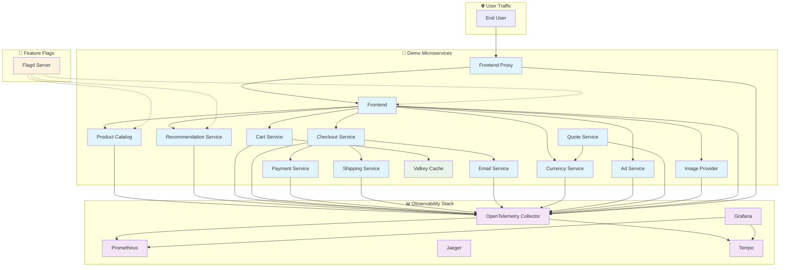
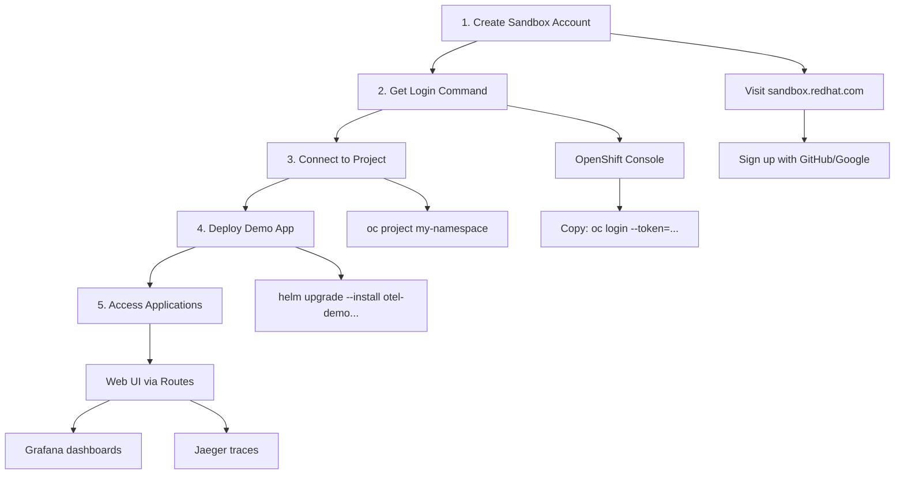
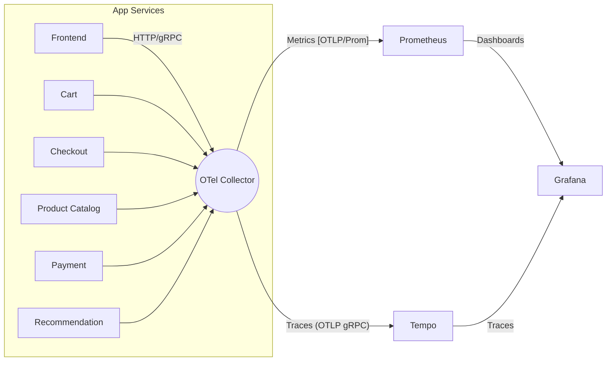

# 🔭 OpenTelemetry Observability Demo (OpenShift)

A practical guide for junior DevOps engineers to deploy, observe,## 🏗️ What Gets Deployed

Complete observability stack with microservices demo:



## Components Status (Current Configuration)

| Component | Status | Purpose |
|-----------|--------|---------|
| ✅ Frontend | Enabled | Web UI for the online shop |
| ✅ Frontend Proxy | Enabled | Envoy proxy with load balancing |
| ✅ Product Catalog | Enabled | Product information service |
| ✅ Recommendation | Enabled | Product recommendation engine |
| ✅ Cart Service | Enabled | Shopping cart management |
| ✅ Checkout Service | Enabled | Order processing |
| ✅ Payment Service | Enabled | Payment processing simulation |
| ✅ Shipping Service | Enabled | Shipping calculation |
| ✅ Email Service | Enabled | Email notifications |
| ✅ Currency Service | Enabled | Currency conversion |
| ✅ Ad Service | Enabled | Advertisement service |
| ✅ Quote Service | Enabled | Price quotation |
| ✅ Image Provider | Enabled | Product image service |
| ✅ Valkey Cache | Enabled | Redis-compatible caching |
| ✅ Flagd | Enabled | Feature flag management |
| ❌ Accounting Service | Disabled | Not included in this deployment |
| ❌ Fraud Detection | Disabled | Not included in this deployment |
| ❌ Load Generator | Disabled | Manual testing preferred |
| ❌ Kafka | Disabled | Uses direct HTTP communication |
| ❌ OpenSearch | Disabled | Uses Tempo for trace storage |

## Observability Tools

| Tool | Purpose | Access via Route |
|------|---------|------------------|
| **Grafana** | Dashboards and visualizations | `/grafana` |
| **Prometheus** | Metrics collection and alerting | `/prometheus` |
| **Tempo** | Distributed tracing backend | Internal only |
| **Jaeger Query** | Trace analysis UI | `/jaeger` |
| **OpenTelemetry Collector** | Telemetry data processing | Internal only |OpenTelemetry Demo on OpenShift with a complete observability stack.

## 🌐 Deploy to OpenShift Developer Sandbox (Free!)

Perfect for learning and experimentation. No credit card required.



### Step-by-step Instructions

#### 1. Create a free OpenShift Developer Sandbox account

```bash
# Visit: https://sandbox.redhat.com/
# Sign up with your GitHub, Google, or Red Hat account
# No credit card required - completely free for learning!
```

#### 2. Get your login command

```bash
# In the OpenShift Console (top-right menu):
# Click your username > "Copy login command"
# Example command you'll get:
oc login --token=sha256~XXXXX --server=https://api.sandbox-m3.1530.p1.openshiftapps.com:6443
```

#### 3. Connect to your project namespace

```bash
# Replace with your actual namespace (usually username-dev or username-stage)
oc project <my-namespace>

# Example:
oc project myuser-dev
```

#### 4. Deploy the demo app with observability stack

```bash
# Clone this repo first
git clone https://github.com/Mistral-valaise/opentelemetry-observability.git
cd opentelemetry-observability

# Deploy (replace <my-namespace> with your actual namespace)
helm upgrade --install otel-demo charts/opentelemetry-demo \
  -f charts/opentelemetry-demo/ocp-values.yaml \
  -n <my-namespace>
```

#### 5. Access your applications

```bash
# Get the routes (external URLs)
oc get routes -n <my-namespace>

# You'll see URLs like:
# frontend-proxy-myuser-dev.apps.sandbox-m3.1530.p1.openshiftapps.com
# grafana-myuser-dev.apps.sandbox-m3.1530.p1.openshiftapps.com
# prometheus-myuser-dev.apps.sandbox-m3.1530.p1.openshiftapps.com
```

Access points:

- **Web Store**: `https://frontend-proxy-<namespace>.apps.sandbox-m3.1530.p1.openshiftapps.com/`
- **Grafana**: `https://grafana-<namespace>.apps.sandbox-m3.1530.p1.openshiftapps.com/`
- **Prometheus**: `https://prometheus-<namespace>.apps.sandbox-m3.1530.p1.openshiftapps.com/`

> 💡 **Tip**: Sandbox environments auto-sleep after 30 days of inactivity. Simply log in again to reactivate!

## 🚀 Quick start

Prereqs: OpenShift access, Helm 3.14+, oc CLI.

```bash
# Project + SA (OpenShift)
oc new-project opentelemetry-demo
oc create sa opentelemetry-demo
oc adm policy add-scc-to-user anyuid -z opentelemetry-demo
oc adm policy add-scc-to-user privileged -z opentelemetry-demo
oc adm policy add-role-to-user view -z opentelemetry-demo

# Install
helm repo add open-telemetry https://open-telemetry.github.io/opentelemetry-helm-charts
helm repo update
helm install otel-demo charts/opentelemetry-demo \
  --namespace opentelemetry-demo \
  --values charts/opentelemetry-demo/ocp-values.yaml \
  --set serviceAccount.create=false \
  --set serviceAccount.name=opentelemetry-demo
```

Access after port-forward: Web <http://localhost:8080/>, Grafana /grafana, Jaeger /jaeger/ui, Loadgen /loadgen.

## 🧠 What’s inside (high level)



Key chart pieces in `charts/opentelemetry-demo/Chart.yaml` (auto-updated by Renovate):

- opentelemetry-collector 0.130.1
- tempo 1.23.3
- jaeger 3.4.1 (disabled by default here)
- prometheus 27.30.0
- grafana 9.3.2
- opensearch 2.35.0 (disabled by default)

OpenShift values live in `charts/opentelemetry-demo/ocp-values.yaml`.

## 🔧 Collector essentials (junior-friendly)

Where: `opentelemetry-collector.config` in `ocp-values.yaml`.

- Receivers: how telemetry arrives
  - otlp (4317 gRPC, 4318 HTTP), httpcheck (pings frontend-proxy), redis
- Processors: mutate/shape data
  - memory_limiter, resource (add k8s attrs), transform (normalize span names)
- Connectors: generate extra metrics
  - spanmetrics (request rate/latency/errors), servicegraph (service map)
- Exporters: where data goes
  - otlp -> Tempo (traces), otlphttp/prometheus -> Prometheus (metrics)

Pipelines:

- traces: receivers [otlp] -> processors [memory_limiter, resource, transform, batch] -> exporters [otlp, debug, spanmetrics, servicegraph]
- metrics: receivers [httpcheck, redis, otlp, spanmetrics, servicegraph] -> processors [memory_limiter, resource, batch] -> exporters [otlphttp/prometheus, debug]
- logs: receivers [otlp] -> processors [memory_limiter, resource, batch] -> exporters [debug]

Tuning tips:

- Low memory? Increase memory_limiter percentages or reduce replicas.
- Not seeing traces? Check app envs point to Collector 4317/4318.
- Want service map? Keep servicegraph connector and Grafana-Tempo configured.

## 📊 SLO-driven monitoring

Prometheus rules (in `ocp-values.yaml`) use spanmetrics to build SLIs/SLOs for the frontend:

- Availability: 5xx ratio over requests
- Latency: 250ms threshold ratio

Dashboards (Grafana): demo, collector, spanmetrics, exemplars. Tempo enables traces-to-metrics and service map.

## 🔄 Automated updates (Renovate)

This repo runs daily scans (2–8am Europe/Zurich) and opens PRs when new versions exist for:

- Helm charts in `Chart.yaml` (helmv3)
- Images in `values.yaml` files (helm-values)
- Vendored subchart archives under `charts/` (auto-refreshed)
- GitHub Actions

See `renovate.json`. Dependency Dashboard issue is enabled.

## �🛠️ Handy ops commands

```bash
# Status & logs
oc get pods -n opentelemetry-demo
oc logs deploy/otel-collector -n opentelemetry-demo

# Collector metrics (prometheus internal)
oc port-forward svc/otel-collector 8889:8889 -n opentelemetry-demo &
curl -s http://localhost:8889/metrics | grep -E 'receiver_accepted|exporter_sent'

# Upgrade with your changes
helm upgrade otel-demo charts/opentelemetry-demo \
  -n opentelemetry-demo \
  -f charts/opentelemetry-demo/ocp-values.yaml
```

## 📚 Pointers

- OpenTelemetry Demo: <https://opentelemetry.io/docs/demo/>
- OTel Helm: <https://github.com/open-telemetry/opentelemetry-helm-charts>
- OpenShift Docs: <https://docs.openshift.com/>
