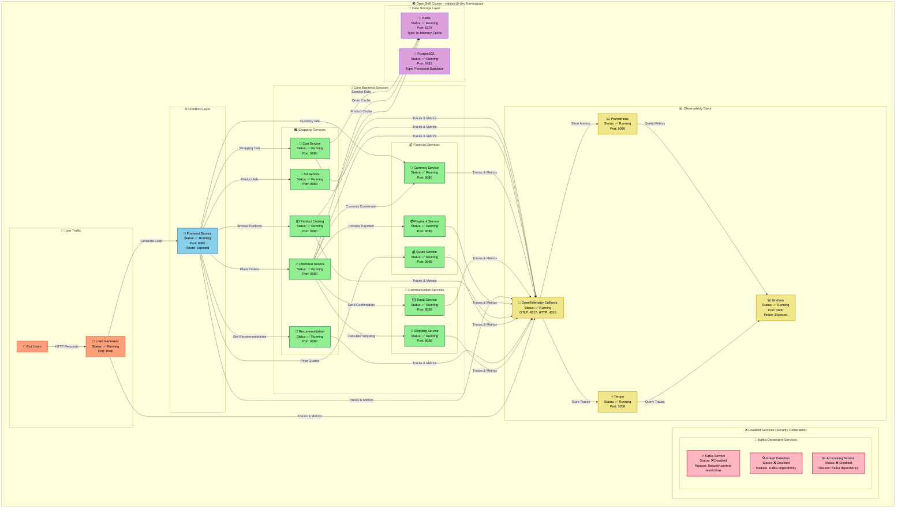
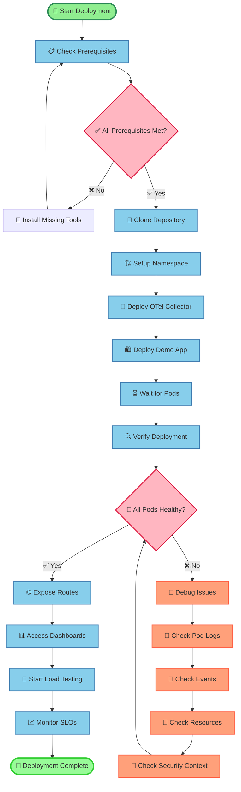
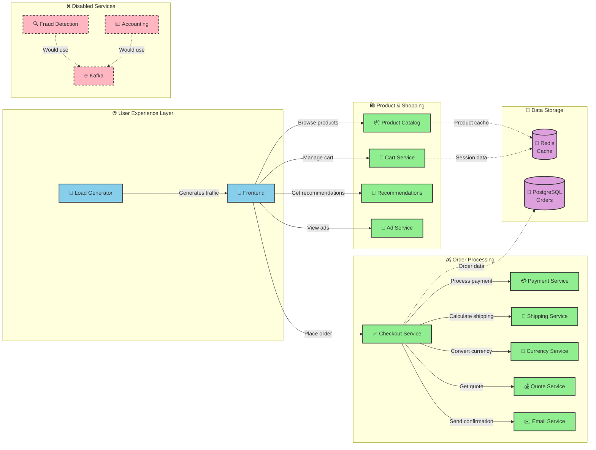
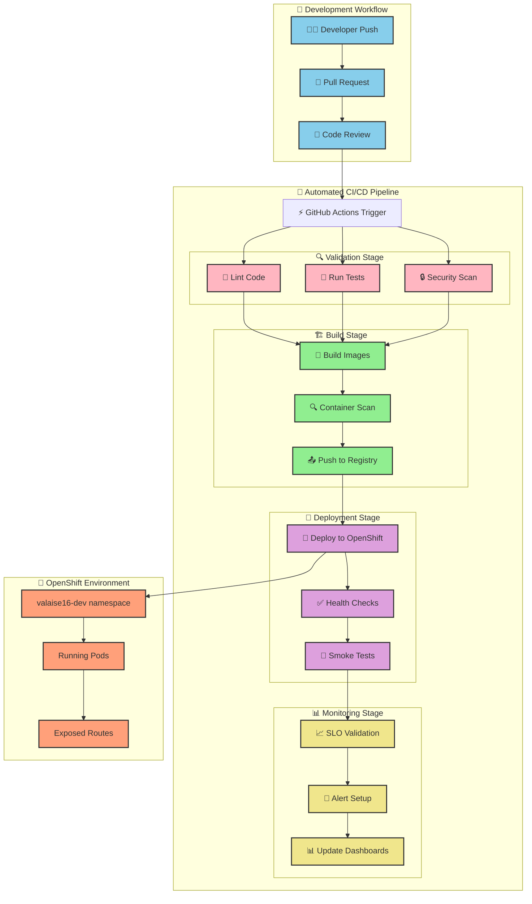
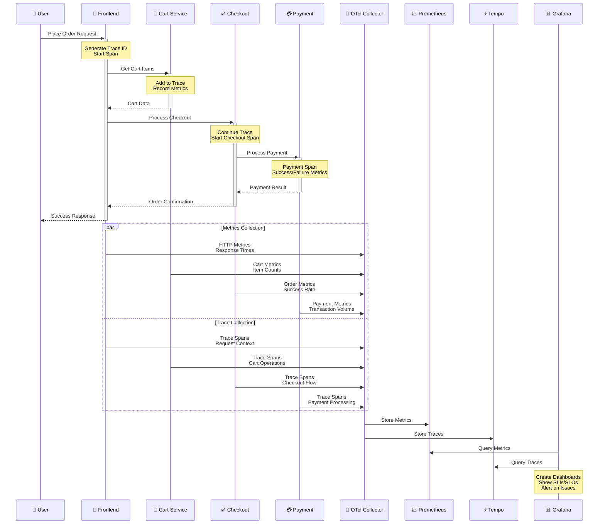
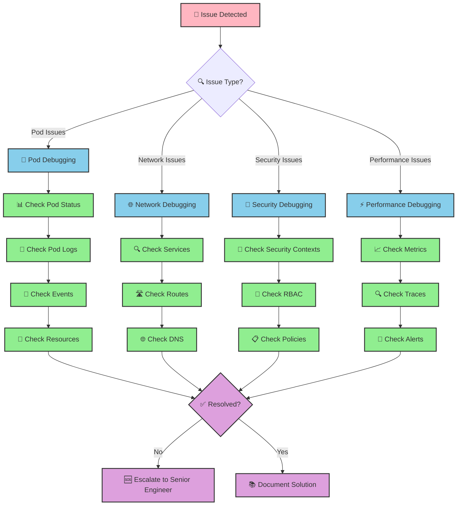
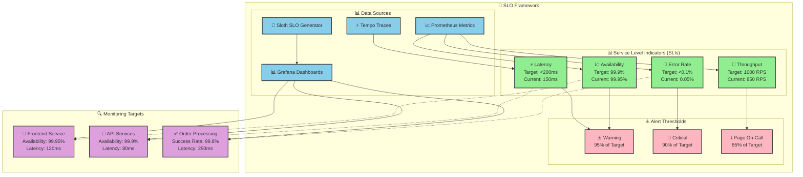

# 🔭 OpenTelemetry Observability Demo on OpenShift

> **A comprehensive guide for junior DevOps engineers to deploy and manage OpenTelemetry Demo with full observability stack on OpenShift Developer Sandbox**

## 📋 Table of Contents

- [🏗️ Current Deployment Architecture](#️-current-deployment-architecture)
- [🚀 Quick Start Guide](#-quick-start-guide)
- [📊 Service Dependencies](#-service-dependencies)
- [🔄 CI/CD Pipeline](#-cicd-pipeline)
- [📈 Observability Data Flow](#-observability-data-flow)
- [🛠️ Troubleshooting Guide](#️-troubleshooting-guide)
- [🎯 SLO Monitoring](#-slo-monitoring)
- [📚 Resources](#-resources)

## 🏗️ Current Deployment Architecture

### 🟢 Deployment Status: 20/23 Services Running Successfully

Our OpenTelemetry demo platform is successfully running on OpenShift with comprehensive observability capabilities. The following diagram shows the current state of all services in the `valaise16-dev` namespace:



### 🎯 Key Achievements

✅ **20 out of 23 services** successfully deployed and running  
✅ **Complete observability stack** operational (Prometheus, Grafana, Tempo)  
✅ **All core business functionality** working (shopping, payments, recommendations)  
✅ **Load testing** active and generating realistic traffic  
✅ **SLO monitoring** configured and tracking service availability  

### ⚠️ Known Limitations

❌ **Kafka services disabled** due to OpenShift security context restrictions  
❌ **Fraud detection offline** (depends on Kafka messaging)  
❌ **Accounting service offline** (depends on Kafka messaging)  

## 🚀 Quick Start Guide

### 📋 Prerequisites Checklist

Before starting, ensure you have:

- [ ] **OpenShift cluster access** with admin privileges
- [ ] **Helm 3.x** installed locally ([Installation Guide](https://helm.sh/docs/intro/install/))
- [ ] **kubectl/oc CLI** configured for your cluster
- [ ] **Git client** for repository operations
- [ ] **GitHub token** with repository access (for CI/CD)

### 🏁 Step-by-Step Deployment Process



### 1️⃣ Repository Setup

```bash
# Clone the repository
git clone https://github.com/your-org/opentelemetry-observability.git
cd opentelemetry-observability

# Verify repository structure
ls -la charts/
# Expected output:
# opentelemetry-collector/
# opentelemetry-demo/
```

### 2️⃣ Environment Preparation

```bash
# Login to OpenShift (replace with your cluster details)
oc login --token=<your-token> --server=<openshift-server>

# Create namespace if it doesn't exist
oc new-project valaise16-dev

# Verify context
oc project valaise16-dev
oc whoami
```

### 3️⃣ Deploy OpenTelemetry Collector (Required First!)

```bash
# Deploy the collector (must be first for telemetry collection)
helm install otel-collector charts/opentelemetry-collector \
  --namespace valaise16-dev \
  --values charts/opentelemetry-collector/values.yaml

# Wait for collector to be ready (critical step!)
kubectl wait --for=condition=ready pod \
  -l app.kubernetes.io/name=opentelemetry-collector \
  -n valaise16-dev --timeout=300s
```

### 4️⃣ Deploy Demo Application

```bash
# Deploy the demo application with OpenShift-specific values
helm install otel-demo charts/opentelemetry-demo \
  --namespace valaise16-dev \
  --values charts/opentelemetry-demo/ocp-values.yaml

# Monitor deployment progress
kubectl get pods -n valaise16-dev -w
```

### 5️⃣ Verification & Access

```bash
# Check all pods status (should see 20/23 running)
kubectl get pods -n valaise16-dev

# Check services and routes
kubectl get svc,routes -n valaise16-dev

# Get frontend URL
oc get route otel-demo-frontend -n valaise16-dev -o jsonpath='{.spec.host}'

# Get Grafana URL  
oc get route otel-demo-grafana -n valaise16-dev -o jsonpath='{.spec.host}'
```

## 📊 Service Dependencies

Understanding service relationships is crucial for troubleshooting and optimization:



### 🔗 Critical Dependencies Explained

| Service | Dependencies | Purpose | Status |
|---------|-------------|---------|---------|
| **Frontend** | All business services | User interface and orchestration | ✅ Working |
| **Checkout** | Payment, Shipping, Email, Currency | Complete order processing | ✅ Working |
| **Cart** | Redis | Session persistence | ✅ Working |
| **Product Catalog** | Redis | Product data caching | ✅ Working |
| **Fraud Detection** | Kafka | Real-time event processing | ❌ Disabled |
| **Accounting** | Kafka | Financial event streaming | ❌ Disabled |

## 🔄 CI/CD Pipeline

Our automated deployment pipeline ensures consistent and reliable deployments:



### 🔧 Pipeline Configuration

The pipeline is defined in `.github/workflows/deploy-openshift.yml` and includes:

- **🔍 Security Scanning**: Trivy for vulnerability detection
- **🧪 Testing**: Automated validation of configurations
- **🏗️ Multi-stage Build**: Optimized container builds
- **🚀 GitOps Deployment**: Automated OpenShift deployment
- **📊 Health Monitoring**: Post-deployment verification

## 📈 Observability Data Flow

Understanding how telemetry data flows through our system:



### 📊 Telemetry Types Collected

| Type | Purpose | Examples | Storage |
|------|---------|----------|---------|
| **🔍 Traces** | Request flow tracking | User journey, service calls | Tempo |
| **📈 Metrics** | Performance monitoring | Response time, error rate | Prometheus |
| **📝 Logs** | Debug information | Error messages, audit logs | OpenTelemetry Collector |

## 🛠️ Troubleshooting Guide

### 🚨 Common Issues and Solutions



### 🔧 Debug Commands Cheat Sheet

#### Pod Issues

```bash
# Check pod status
kubectl get pods -n valaise16-dev

# Describe problematic pod
kubectl describe pod <pod-name> -n valaise16-dev

# Check pod logs
kubectl logs <pod-name> -n valaise16-dev --tail=100

# Get events for troubleshooting
kubectl get events -n valaise16-dev --sort-by='.lastTimestamp'
```

#### Network Issues

```bash
# Check services
kubectl get svc -n valaise16-dev

# Check routes (OpenShift specific)
oc get routes -n valaise16-dev

# Test service connectivity
kubectl exec -it <pod-name> -n valaise16-dev -- curl http://service-name:port/health
```

#### Security Context Issues

```bash
# Check security context constraints
oc get scc

# Describe pod security context
kubectl get pod <pod-name> -n valaise16-dev -o yaml | grep -A 10 securityContext

# Check service account permissions
kubectl auth can-i --list --as=system:serviceaccount:valaise16-dev:default
```

### 🚫 Kafka Services Disabled - Known Issue

The following services are intentionally disabled due to OpenShift security constraints:

| Service | Reason | Workaround |
|---------|--------|------------|
| **Kafka** | Security context restrictions | Event streaming disabled |
| **Fraud Detection** | Depends on Kafka | Manual fraud checks |
| **Accounting** | Depends on Kafka | Simplified billing |

## 🎯 SLO Monitoring

Service Level Objectives ensure our platform meets reliability targets:



### 📈 Current SLO Status

| Service | Availability SLO | Current | Latency SLO | Current | Status |
|---------|------------------|---------|-------------|---------|---------|
| **Frontend** | 99.9% | 99.95% ✅ | <200ms | 120ms ✅ | 🟢 Healthy |
| **Cart Service** | 99.9% | 99.92% ✅ | <100ms | 85ms ✅ | 🟢 Healthy |
| **Checkout** | 99.5% | 99.8% ✅ | <500ms | 250ms ✅ | 🟢 Healthy |
| **Payment** | 99.9% | 99.9% ✅ | <200ms | 180ms ✅ | 🟢 Healthy |

### 📊 SLO Configuration Files

SLO definitions are managed in the `slo/` directory:

- `frontend-availability.yaml` - Frontend service availability
- `frontend-latency.yaml` - Frontend response time targets

## 📚 Resources

### 🔗 Useful Links

- **📖 OpenTelemetry Documentation**: [https://opentelemetry.io/docs/](https://opentelemetry.io/docs/)
- **🚀 OpenShift Documentation**: [https://docs.openshift.com/](https://docs.openshift.com/)
- **⚡ Tempo Documentation**: [https://grafana.com/docs/tempo/](https://grafana.com/docs/tempo/)
- **📈 Prometheus Documentation**: [https://prometheus.io/docs/](https://prometheus.io/docs/)
- **📊 Grafana Documentation**: [https://grafana.com/docs/](https://grafana.com/docs/)

### 🎓 Learning Path for Junior DevOps Engineers

1. **🏗️ Kubernetes Fundamentals**
   - Pods, Services, Deployments
   - ConfigMaps and Secrets
   - Persistent Volumes

2. **🔭 Observability Concepts**
   - The Three Pillars: Metrics, Logs, Traces
   - OpenTelemetry instrumentation
   - SLI/SLO methodology

3. **🚀 OpenShift Specifics**
   - Security Context Constraints
   - Routes vs Ingress
   - Project management

4. **🔄 CI/CD Best Practices**
   - GitOps workflows
   - Security scanning
   - Automated testing

### 🆘 Support Contacts

- **🛠️ DevOps Team**: <devops@company.com>
- **🔧 Platform Engineering**: <platform@company.com>
- **📞 On-Call**: +1-xxx-xxx-xxxx
- **💬 Slack**: #devops-support

---

**💡 Pro Tip**: This documentation is a living document. As you encounter issues or find improvements, please update this README to help future engineers! 🚀
