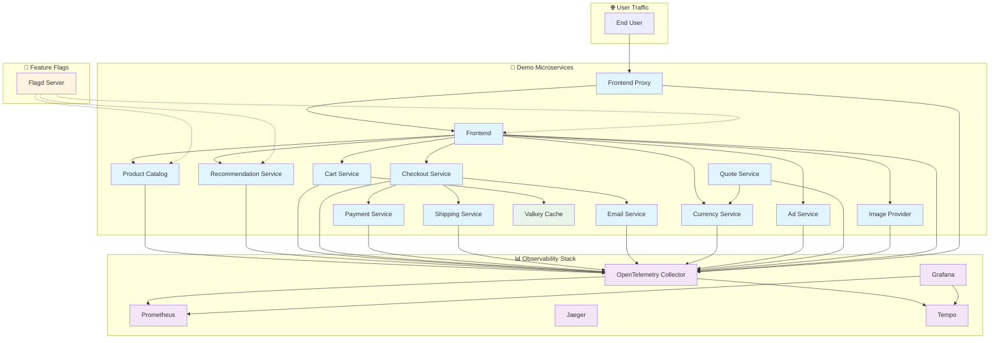
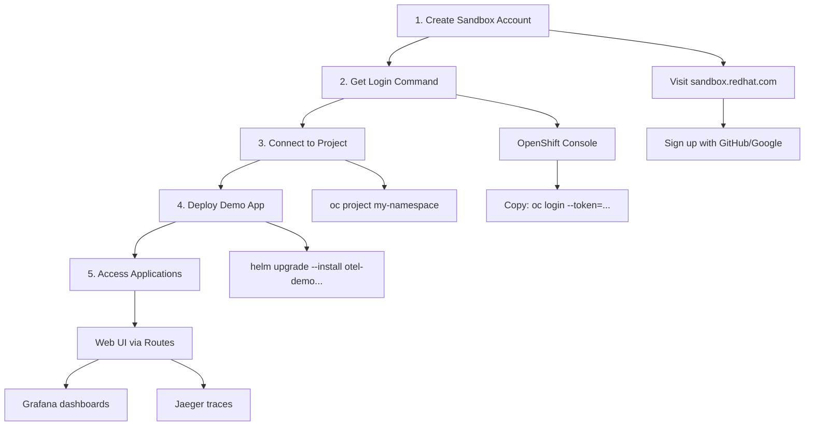
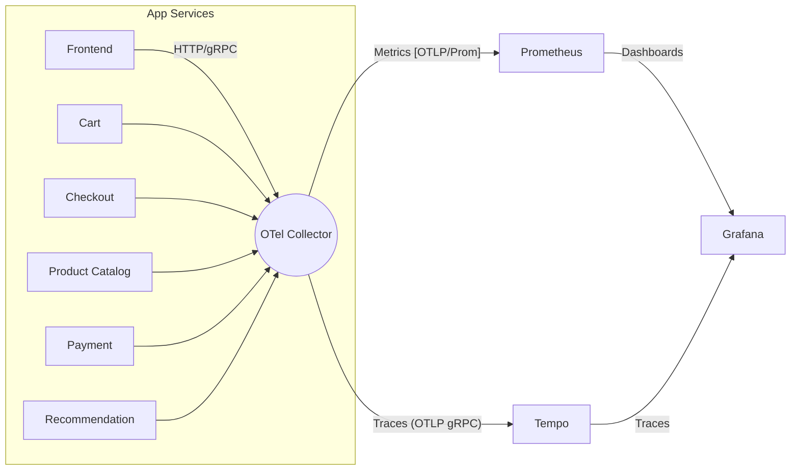
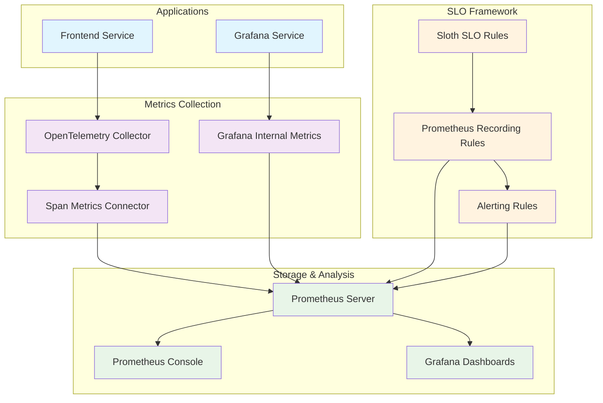

# 🔭 OpenTelemetry Observability Demo (OpenShift)

A practical guide for junior DevOps engineers to deploy, observe,## 🏗️ What Gets Deployed

Complete observability stack with microservices demo:



## Components Status (Current Configuration)

| Component | Status | Purpose |
|-----------|--------|---------|
| ✅ Frontend | Enabled | Web UI for the online shop |
| ✅ Frontend Proxy | Enabled | Envoy proxy with load balancing |
| ✅ Product Catalog | Enabled | Product information service |
| ✅ Recommendation | Enabled | Product recommendation engine |
| ✅ Cart Service | Enabled | Shopping cart management |
| ✅ Checkout Service | Enabled | Order processing |
| ✅ Payment Service | Enabled | Payment processing simulation |
| ✅ Shipping Service | Enabled | Shipping calculation |
| ✅ Email Service | Enabled | Email notifications |
| ✅ Currency Service | Enabled | Currency conversion |
| ✅ Ad Service | Enabled | Advertisement service |
| ✅ Quote Service | Enabled | Price quotation |
| ✅ Image Provider | Enabled | Product image service |
| ✅ Valkey Cache | Enabled | Redis-compatible caching |
| ✅ Flagd | Enabled | Feature flag management |
| ❌ Accounting Service | Disabled | Not included in this deployment |
| ❌ Fraud Detection | Disabled | Not included in this deployment |
| ❌ Load Generator | Disabled | Manual testing preferred |
| ❌ Kafka | Disabled | Uses direct HTTP communication |
| ❌ OpenSearch | Disabled | Uses Tempo for trace storage |

## Observability Tools

| Tool | Purpose | Access via Route |
|------|---------|------------------|
| **Grafana** | Dashboards and visualizations | `/grafana` |
| **Prometheus** | Metrics collection and alerting | `/prometheus` |
| **Tempo** | Distributed tracing backend | Internal only |
| **OpenTelemetry Collector** | Telemetry data processing | Internal only |OpenTelemetry Demo on OpenShift with a complete observability stack.

## 🌐 Deploy to OpenShift Developer Sandbox (Free!)

Perfect for learning and experimentation. No credit card required.



### Step-by-step Instructions

#### 1. Create a free OpenShift Developer Sandbox account

```bash
# Visit: https://sandbox.redhat.com/
# Sign up with your GitHub, Google, or Red Hat account
# No credit card required - completely free for learning!
```

#### 2. Get your login command

```bash
# In the OpenShift Console (top-right menu):
# Click your username > "Copy login command"
# Example command you'll get:
oc login --token=sha256~XXXXX --server=https://api.sandbox-m3.1530.p1.openshiftapps.com:6443
```

#### 3. Connect to your project namespace

```bash
# Replace with your actual namespace (usually username-dev or username-stage)
oc project <my-namespace>

# Example:
oc project myuser-dev
```

#### 4. Deploy the demo app with observability stack

```bash
# Clone this repo first
git clone https://github.com/Mistral-valaise/opentelemetry-observability.git
cd opentelemetry-observability

# Deploy (replace <my-namespace> with your actual namespace)
helm upgrade --install otel-demo charts/opentelemetry-demo \
  -f charts/opentelemetry-demo/ocp-values.yaml \
  -n <my-namespace>
```

#### 5. Access your applications

```bash
# Get the routes (external URLs)
oc get routes -n <my-namespace>

# You'll see URLs like:
# frontend-proxy-myuser-dev.apps.sandbox-m3.1530.p1.openshiftapps.com
# grafana-myuser-dev.apps.sandbox-m3.1530.p1.openshiftapps.com
# prometheus-myuser-dev.apps.sandbox-m3.1530.p1.openshiftapps.com
```

Access points:

- **Web Store**: `https://frontend-proxy-<namespace>.apps.sandbox-m3.1530.p1.openshiftapps.com/`
- **Grafana**: `https://grafana-<namespace>.apps.sandbox-m3.1530.p1.openshiftapps.com/`
- **Prometheus**: `https://prometheus-<namespace>.apps.sandbox-m3.1530.p1.openshiftapps.com/`

> 💡 **Tip**: Sandbox environments auto-sleep after 30 days of inactivity. Simply log in again to reactivate!

## 🧠 What’s inside (high level)



Key chart pieces in `charts/opentelemetry-demo/Chart.yaml` (auto-updated by Renovate):

- opentelemetry-collector 0.130.1
- tempo 1.23.3
- jaeger 3.4.1 (disabled by default here)
- prometheus 27.30.0
- grafana 9.3.2
- opensearch 2.35.0 (disabled by default)

OpenShift values live in `charts/opentelemetry-demo/ocp-values.yaml`.

## 🔧 Collector essentials (junior-friendly)

Where: `opentelemetry-collector.config` in `ocp-values.yaml`.

- Receivers: how telemetry arrives
  - otlp (4317 gRPC, 4318 HTTP), httpcheck (pings frontend-proxy), redis
- Processors: mutate/shape data
  - memory_limiter, resource (add k8s attrs), transform (normalize span names)
- Connectors: generate extra metrics
  - spanmetrics (request rate/latency/errors), servicegraph (service map)
- Exporters: where data goes
  - otlp -> Tempo (traces), otlphttp/prometheus -> Prometheus (metrics)

Pipelines:

- traces: receivers [otlp] -> processors [memory_limiter, resource, transform, batch] -> exporters [otlp, debug, spanmetrics, servicegraph]
- metrics: receivers [httpcheck, redis, otlp, spanmetrics, servicegraph] -> processors [memory_limiter, resource, batch] -> exporters [otlphttp/prometheus, debug]
- logs: receivers [otlp] -> processors [memory_limiter, resource, batch] -> exporters [debug]

Tuning tips:

- Low memory? Increase memory_limiter percentages or reduce replicas.
- Not seeing traces? Check app envs point to Collector 4317/4318.
- Want service map? Keep servicegraph connector and Grafana-Tempo configured.

## 📊 SLO-driven monitoring

Prometheus rules (in `ocp-values.yaml`) use spanmetrics to build SLIs/SLOs for the frontend:

- Availability: 5xx ratio over requests
- Latency: 250ms threshold ratio

Dashboards (Grafana): demo, collector, spanmetrics, exemplars. Tempo enables traces-to-metrics and service map.

## 🎯 Service Level Objectives (SLOs)

This deployment includes comprehensive SLO monitoring following Google SRE Workbook principles with Sloth SLO framework.

### SLO Summary Table

| Service | SLO Type | Target | Time Window | Error Budget | SLI Query | Alert Thresholds |
|---------|----------|--------|-------------|--------------|-----------|------------------|
| **Grafana** | Availability | 99.0% | 28 days | 1.0% | `grafana_http_request_duration_seconds_count{status_code!~"5.*,429"}` | 2x/14x (5min/1hr burn) |
| **Grafana** | Latency (250ms) | 95.0% | 28 days | 5.0% | `histogram_quantile(0.95, grafana_http_request_duration_seconds_bucket) < 0.25` | 2x/14x (5min/1hr burn) |
| **Grafana** | Latency (100ms) | 90.0% | 28 days | 10.0% | `histogram_quantile(0.90, grafana_http_request_duration_seconds_bucket) < 0.10` | 2x/14x (5min/1hr burn) |
| **Frontend** | Availability | 99.0% | 28 days | 1.0% | `traces_span_metrics_calls_total{service_name="frontend",http_status_code!~"5.*,429"}` | 2x/14x (5min/1hr burn) |
| **Frontend** | Latency (250ms) | 95.0% | 28 days | 5.0% | `histogram_quantile(0.95, traces_span_metrics_duration_bucket{service_name="frontend"}) < 0.25` | 2x/14x (5min/1hr burn) |
| **Frontend** | Latency (100ms) | 90.0% | 28 days | 10.0% | `histogram_quantile(0.90, traces_span_metrics_duration_bucket{service_name="frontend"}) < 0.10` | 2x/14x (5min/1hr burn) |

### SLO Configuration Details

#### Grafana Service SLOs

- **Service Scope**: Grafana web interface and API endpoints
- **Data Source**: Grafana's own metrics (`grafana_http_request_duration_seconds_*`)
- **SLI Implementation**: Request-based availability and latency percentiles
- **File Location**: `slo-rules/grafana.yml` → ConfigMap `prometheus-slo-rules-grafana`

#### Frontend Service SLOs

- **Service Scope**: OpenTelemetry Demo frontend service
- **Data Source**: Span metrics generated by OpenTelemetry Collector (`traces_span_metrics_*`)
- **SLI Implementation**: Span-based availability and latency percentiles
- **File Location**: `slo-rules/otel-frontend.yml` → ConfigMap `prometheus-slo-rules-frontend`

### Error Budget Burn Rate Alerting

Each SLO includes multi-window, multi-burn-rate alerting following SRE best practices:

| Alert Type | Burn Rate | Time Window | Severity | Action Required |
|------------|-----------|-------------|----------|-----------------|
| **Fast Burn** | 14.4x | 1 hour | Page | Immediate investigation |
| **Slow Burn** | 6x | 6 hours | Ticket | Investigation within 24h |
| **Medium Burn** | 3x | 24 hours | Ticket | Investigation within 3 days |
| **Very Slow Burn** | 1x | 3 days | Ticket | Long-term trend analysis |

### Prometheus Console Templates

SLO dashboards are available via Prometheus console at `/consoles/`:

- **SLO Report** (`/consoles/slo-report.html`): Overview of all SLOs, error budgets, and burn rates
- **Service Overview** (`/consoles/index.html`): Service health and SLO status dashboard
- **Prometheus Status** (`/consoles/prometheus.html`): Prometheus server and rule evaluation status

### Grafana SLO Dashboards

Pre-configured Grafana dashboards for SLO visualization:

- **Sloth SLO Detail** (ID: 14348): Detailed view of individual SLOs with burn rates and error budget consumption
- **Sloth SLOs High Level** (ID: 14643): Overview dashboard showing all SLOs at a glance
- **Prometheus Stats** (ID: 15489): Prometheus server performance and rule evaluation metrics

### SLO Monitoring Architecture



### Accessing SLO Monitoring

1. **Prometheus Console**: `https://prometheus-<namespace>.apps.sandbox-m3.1530.p1.openshiftapps.com/consoles/`
2. **Grafana SLO Dashboards**: `https://grafana-<namespace>.apps.sandbox-m3.1530.p1.openshiftapps.com/`
3. **Raw Metrics**: Query `slo:*` metrics in Prometheus for programmatic access

## 🔄 Automated updates (Renovate)

This repo runs daily scans (2–8am Europe/Zurich) and opens PRs when new versions exist for:

- Helm charts in `Chart.yaml` (helmv3)
- Images in `values.yaml` files (helm-values)
- Vendored subchart archives under `charts/` (auto-refreshed)
- GitHub Actions

See `renovate.json`. Dependency Dashboard issue is enabled.

## �🛠️ Handy ops commands

```bash
# Status & logs
oc get pods -n opentelemetry-demo
oc logs deploy/otel-collector -n opentelemetry-demo

# Collector metrics (prometheus internal)
oc port-forward svc/otel-collector 8889:8889 -n opentelemetry-demo &
curl -s http://localhost:8889/metrics | grep -E 'receiver_accepted|exporter_sent'

# Upgrade with your changes
helm upgrade otel-demo charts/opentelemetry-demo \
  -n opentelemetry-demo \
  -f charts/opentelemetry-demo/ocp-values.yaml
```

## 📚 Pointers

- OpenTelemetry Demo: <https://opentelemetry.io/docs/demo/>
- OTel Helm: <https://github.com/open-telemetry/opentelemetry-helm-charts>
- OpenShift Docs: <https://docs.openshift.com/>
