# 🔭 OpenTelemetry Observability Demo on OpenShift

> **Quick deployment guide for OpenTelemetry Demo with full observability stack on OpenShift - optimized for junior DevOps engineers**

## 📋 Quick Navigation

- [🚀 Quick Start](#-quick-start)
- [🏗️ Architecture Overview](#️-architecture-overview)
- [🔧 Configuration](#-configuration)
- [📊 Monitoring & Observability](#-monitoring--observability)
- [🛠️ Troubleshooting](#️-troubleshooting)
- [🔄 Maintenance](#-maintenance)

## 🚀 Quick Start

### Prerequisites

- OpenShift cluster access (Developer Sandbox works!)
- Helm 3.14+
- `oc` CLI tool

### 1️⃣ Deploy in 3 Steps

```bash
# 1. Create project and service account
oc new-project opentelemetry-demo
oc create sa opentelemetry-demo
oc adm policy add-scc-to-user anyuid -z opentelemetry-demo
oc adm policy add-scc-to-user privileged -z opentelemetry-demo
oc adm policy add-role-to-user view -z opentelemetry-demo

# 2. Add Helm repo and install
helm repo add open-telemetry https://open-telemetry.github.io/opentelemetry-helm-charts
helm repo update

# 3. Deploy with OpenShift-optimized values
helm install otel-demo charts/opentelemetry-demo \
  --namespace opentelemetry-demo \
  --values charts/opentelemetry-demo/ocp-values.yaml \
  --set serviceAccount.create=false \
  --set serviceAccount.name=opentelemetry-demo
```

### 2️⃣ Access Applications

```bash
# Get routes (if configured)
oc get routes

# Or use port-forwarding
oc port-forward svc/frontend-proxy 8080:8080
```

**Access URLs** (after port-forward):

- 🏪 **Webstore**: <http://localhost:8080/>
- 📊 **Grafana**: <http://localhost:8080/grafana/> (admin/admin)
- 🔍 **Jaeger**: <http://localhost:8080/jaeger/ui/>
- 🚀 **Load Generator**: <http://localhost:8080/loadgen/>

## 🏗️ Architecture Overview

### Current Status: 20/23 Services Running ✅

```mermaid
graph TB
    subgraph "🌐 Frontend & Load"
        LG[🚀 Load Generator<br/>✅ Running]
        FE[🏪 Frontend<br/>✅ Running]
    end
    
    subgraph "🛍️ Business Services"
        AS[📢 Ad Service<br/>✅ Running]
        CS[🛒 Cart Service<br/>✅ Running]
        COS[✅ Checkout Service<br/>✅ Running]
        PCS[📦 Product Catalog<br/>✅ Running]
        PS[💳 Payment Service<br/>✅ Running]
        SS[🚚 Shipping Service<br/>✅ Running]
        ES[✉️ Email Service<br/>✅ Running]
        RS[🎯 Recommendation<br/>✅ Running]
        CUS[💱 Currency Service<br/>✅ Running]
        QS[💰 Quote Service<br/>✅ Running]
    end
    
    subgraph "❌ Disabled (Security Constraints)"
        KS[🔥 Kafka<br/>❌ Disabled]
        FDS[🔍 Fraud Detection<br/>❌ Disabled]
        ACS[📊 Accounting<br/>❌ Disabled]
    end
    
    subgraph "💾 Storage"
        RD[🔴 Redis<br/>✅ Running]
        PG[🐘 PostgreSQL<br/>✅ Running]
    end
    
    subgraph "📊 Observability"
        OC[🔭 OTel Collector<br/>✅ Running]
        PR[📈 Prometheus<br/>✅ Running]
        GR[📊 Grafana<br/>✅ Running]
        TP[⚡ Tempo<br/>✅ Running]
    end
    
    LG --> FE
    FE --> AS & CS & COS & PCS
    COS --> PS & SS & ES & CUS
    CS --> RD
    PCS --> RD
    
    AS & CS & COS & PCS & PS & SS & ES & RS & CUS & QS --> OC
    OC --> PR & TP
    PR --> GR
    TP --> GR
```



### Key Components

| Component | Purpose | Status | Port |
|-----------|---------|--------|------|
| **Frontend** | Web UI & reverse proxy | ✅ | 8080 |
| **OTel Collector** | Telemetry data collection | ✅ | 4317/4318 |
| **Prometheus** | Metrics storage | ✅ | 9090 |
| **Grafana** | Visualization dashboard | ✅ | 3000 |
| **Jaeger** | Distributed tracing | ✅ | 16686 |
| **Tempo** | Trace storage backend | ✅ | 3200 |

## 🔧 Configuration

### Essential Files

- `charts/opentelemetry-demo/Chart.yaml` - Helm chart metadata & dependencies
- `charts/opentelemetry-demo/values.yaml` - Default configuration
- `charts/opentelemetry-demo/ocp-values.yaml` - OpenShift-specific overrides

### Key Helm Dependencies

```yaml
dependencies:
  - opentelemetry-collector: 0.130.1
  - prometheus: 27.30.0
  - grafana: 9.3.2
  - jaeger: 3.4.1
  - tempo: 1.23.3
  - opensearch: 2.35.0
```

### Common Customizations

```yaml
# Scale down for resource constraints
default:
  replicas: 1

# Disable resource-heavy components
prometheus:
  server:
    persistentVolume:
      enabled: false

# Enable routes for external access
ingress:
  enabled: true
  hosts:
    - host: otel-demo.apps.your-cluster.com
```

## 📊 Monitoring & Observability

### Key Dashboards in Grafana

1. **Demo Dashboard** - Application metrics overview
2. **OTel Collector** - Collector performance metrics
3. **Span Metrics** - Trace-derived metrics
4. **Exemplars** - Metrics to traces correlation

### Important Metrics to Monitor

- `http_server_duration` - Request latency
- `http_server_requests_total` - Request count
- `otelcol_receiver_accepted_spans` - Trace ingestion
- `prometheus_tsdb_symbol_table_size` - Prometheus health

### Useful Queries

```promql
# Request rate by service
rate(http_server_requests_total[5m])

# 95th percentile latency
histogram_quantile(0.95, http_server_duration_bucket)

# Error rate
rate(http_server_requests_total{status_code!~"2.."}[5m])
```

## 🛠️ Troubleshooting

### Common Issues

#### 1. Services Not Starting

```bash
# Check pod status
oc get pods

# Check specific pod logs
oc logs <pod-name> -c <container-name>

# Check events
oc get events --sort-by=.metadata.creationTimestamp
```

#### 2. Missing Traces/Metrics

```bash
# Check OTel Collector health
oc port-forward svc/otel-collector 8889:8889
curl http://localhost:8889/metrics

# Verify service instrumentation
oc logs deployment/frontend | grep -i otel
```

#### 3. Grafana Dashboard Issues

```bash
# Check Grafana logs
oc logs deployment/grafana

# Verify data sources
oc port-forward svc/grafana 3000:3000
# Navigate to Configuration > Data Sources
```

#### 4. Resource Constraints

```bash
# Check resource usage
oc top pods
oc describe node

# Scale down if needed
helm upgrade otel-demo charts/opentelemetry-demo \
  --set default.replicas=1 \
  --set prometheus.server.persistentVolume.enabled=false
```

### Debug Commands

```bash
# Check all resources
oc get all -l app.kubernetes.io/instance=otel-demo

# Describe failing deployment
oc describe deployment <deployment-name>

# Check service endpoints
oc get endpoints

# View current Helm values
helm get values otel-demo
```

## 🔄 Maintenance

### Updates & Dependencies

This repository uses **Renovate Bot** for automated dependency management:

- 🤖 **Daily scans** for new versions
- 🔄 **Automatic PRs** for updates
- 🧪 **Requires manual testing** before merge
- 📊 **Dependency dashboard** available in Issues

### Manual Update Process

```bash
# Update Helm dependencies
helm repo update

# Check for chart updates
helm search repo open-telemetry/opentelemetry-demo

# Upgrade installation
helm upgrade otel-demo charts/opentelemetry-demo \
  --namespace opentelemetry-demo \
  --values charts/opentelemetry-demo/ocp-values.yaml
```

### Health Checks

```bash
# Quick health check script
for svc in frontend prometheus grafana jaeger; do
  echo "Checking $svc..."
  oc get pod -l app.kubernetes.io/name=$svc
done

# Check observability data flow
oc port-forward svc/otel-collector 8889:8889 &
curl -s http://localhost:8889/metrics | grep -E "(receiver_accepted|exporter_sent)"
```

### Backup Important Data

```bash
# Export Grafana dashboards
oc get configmap grafana-dashboards -o yaml > grafana-dashboards-backup.yaml

# Export Prometheus rules (if any)
oc get prometheusrule -o yaml > prometheus-rules-backup.yaml
```

## 📚 Quick Reference

### Useful Links

- [OpenTelemetry Demo Docs](https://opentelemetry.io/docs/demo/)
- [Helm Chart Source](https://github.com/open-telemetry/opentelemetry-helm-charts)
- [OpenShift Documentation](https://docs.openshift.com/)

### Important Labels & Selectors

```bash
# All demo components
app.kubernetes.io/instance=otel-demo

# Specific service type
app.kubernetes.io/component=<service-name>

# Observability stack
app.kubernetes.io/part-of=opentelemetry-demo
```

---

💡 **Pro Tip**: Always test changes in a development environment first. Use `helm diff` plugin to preview changes before applying updates.

## 🔄 Automated Dependency Management

This repository includes **Renovate Bot** configuration for automatic dependency updates:

- 🤖 **Daily automated scans** for new versions
- 📦 **Helm chart dependencies** monitoring
- 🐳 **Docker image updates** tracking  
- 🔍 **Security vulnerability** alerts
- 📊 **Dependency dashboard** in GitHub Issues

### Monitored Components

- OpenTelemetry Collector
- Prometheus, Grafana, Jaeger, Tempo
- All Helm chart dependencies
- GitHub Actions
- Container images

See `renovate.json` for complete configuration.
