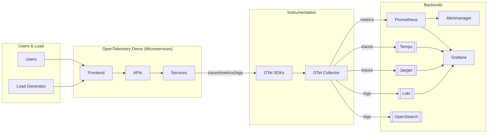
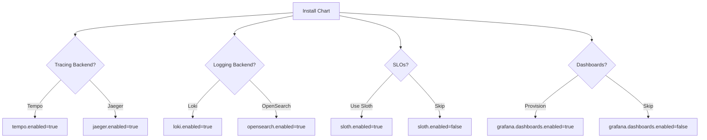
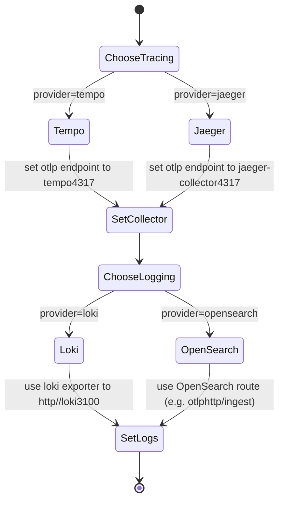
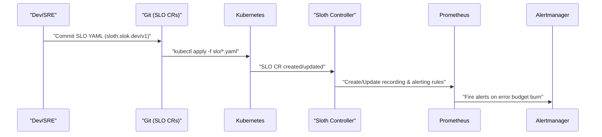
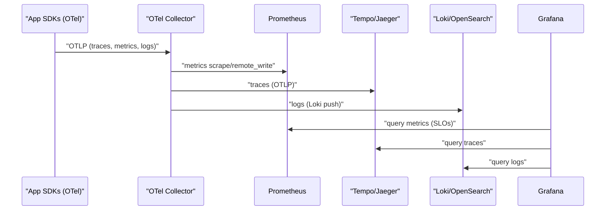

# OpenTelemetry Observability Demo — SLO Monitoring with Tempo/Jaeger & Loki/OpenSearch

A practical, batteries‑included guide to run the **OpenTelemetry Demo** Helm chart with optional backends for **traces (Tempo or Jaeger)** and **logs (Loki or OpenSearch)**, plus **SLO monitoring** using **Sloth** and preloaded **Grafana dashboards**.

This README is written for junior DevOps / SREs and includes step‑by‑step commands, opinionated defaults, and many diagrams.

---

## TL;DR

- Deploy the OpenTelemetry Demo via Helm.
- Pick your tracing backend: **Tempo** _or_ **Jaeger**.
- Pick your logging backend: **Loki** _or_ **OpenSearch**.
- Enable **Sloth** to generate SLOs (Prometheus rules + alerts) and auto‑provision **Grafana SLO dashboards**.
- Switch stacks via `values.yaml` toggles.

---

## High‑Level Architecture



> **Note**: You choose **one** tracing backend (Tempo *or* Jaeger) and **one** logging backend (Loki *or* OpenSearch). Metrics always land in Prometheus.

---

## Choose Your Stack (Feature Toggles)



All options are controlled via `values.yaml`. See the schema below.

---

## Prerequisites

- Kubernetes ≥ 1.25
- Helm ≥ 3.12
- Cluster with enough CPU/RAM for the demo stack
- `kubectl` context set to your target cluster/namespace
- Optional: an Ingress controller, or use `kubectl port-forward`

---

## Repository Layout (suggested)

```
./
├─ charts/
│  └─ opentelemetry-demo/        # vendored upstream chart (as git submodule or subtree)
├─ values/
│  ├─ values.observability.yaml  # your main toggle file
│  ├─ values.tempo-loki.yaml     # example profile
│  ├─ values.jaeger-opensearch.yaml
│  └─ slo/                       # Sloth SLO CRs for services
│     ├─ frontend-availability.yaml
│     └─ frontend-latency.yaml
└─ README.md
```

> If you keep the upstream chart external, reference it via `--repo` instead. This repo focuses on overlay values and SLO manifests.

---

## Values Schema (opinionated)

> This layer sits **on top of** the OpenTelemetry Demo chart and related backend charts. You can keep all toggles in a single file.

```yaml
# values/values.observability.yaml
observability:
  tracing:
    provider: tempo   # one of: tempo, jaeger
    enabled: true
    tempo:
      enabled: true
      # Service name of Tempo OTLP endpoint (gRPC):
      otlpEndpoint: "tempo:4317"
      insecure: true
    jaeger:
      enabled: false
      # Jaeger collector OTLP gRPC endpoint:
      otlpEndpoint: "jaeger-collector:4317"
      insecure: true

  logging:
    provider: loki   # one of: loki, opensearch
    enabled: true
    loki:
      enabled: true
      pushEndpoint: "http://loki:3100/loki/api/v1/push"
    opensearch:
      enabled: false
      hosts:
        - "https://opensearch:9200"
      index: "logs-otel"

  metrics:
    prometheus:
      enabled: true
      # Example remote write if you need it:
      remoteWrite: []

  dashboards:
    grafana:
      enabled: true
      # Ensure Grafana sidecars can pick up dashboards & datasources
      sidecar:
        dashboards:
          enabled: true
        datasources:
          enabled: true

sloth:
  enabled: true
  # Install the Sloth controller via Helm and apply SLO CRs in this namespace
  installController: true
  namespace: "opentelemetry-demo"
  sloFiles:
    - values/slo/frontend-availability.yaml
    - values/slo/frontend-latency.yaml

# Wire collector exporters based on chosen providers
opentelemetryCollector:
  config:
    exporters:
      otlp/traces:
        endpoint: {{ .Values.observability.tracing.provider | quote }}
      # (We will set the real endpoint via templating below.)
      loki:
        endpoint: {{ .Values.observability.logging.loki.pushEndpoint | quote }}
        labels:
          resource:
            service_name: service.name
    service:
      pipelines:
        traces:
          receivers: [otlp]
          processors: [batch]
          exporters: [otlp]
        metrics:
          receivers: [otlp]
          processors: [batch]
          exporters: [prometheus]
        logs:
          receivers: [otlp]
          processors: [batch]
          exporters: [loki]
```

> The actual collector `config` will be slightly different depending on your chart structure. The idea: set the **trace exporter** to either Tempo (OTLP endpoint) or Jaeger (OTLP endpoint), and the **log exporter** to either Loki or OpenSearch (for OpenSearch, use the `otlphttp` exporter if you’re sending logs to an OTLP‐capable gateway, or a community exporter).

---

## How the Toggle Resolves (Template Logic)



You can implement this as Helm template conditionals that patch the Collector’s exporters and Grafana datasources.

---

## Installing the Stack

1) **Add Helm repos** (examples):

```bash
helm repo add open-telemetry https://open-telemetry.github.io/opentelemetry-helm-charts
helm repo add grafana https://grafana.github.io/helm-charts
helm repo add slok https://charts.slok.dev
helm repo update
```

2) **Create a namespace**:

```bash
kubectl create namespace opentelemetry-demo
```

3) **Install/upgrade backends** (pick one per category):

- **Tempo**

  ```bash
  helm upgrade --install tempo grafana/tempo \
    --namespace opentelemetry-demo \
    --set tempo.queryFrontend.query.rangeQuery.enabled=true
  ```

- **Jaeger** (example minimal):

  ```bash
  helm upgrade --install jaeger open-telemetry/jaeger \
    --namespace opentelemetry-demo
  ```

- **Loki**:

  ```bash
  helm upgrade --install loki grafana/loki \
    --namespace opentelemetry-demo
  ```

- **OpenSearch** (operator or chart of your choice):

  ```bash
  helm upgrade --install opensearch opensearch/opensearch \
    --namespace opentelemetry-demo
  ```

4) **Install Grafana** with sidecars to auto‑load dashboards/datasources:

```bash
helm upgrade --install grafana grafana/grafana \
  --namespace opentelemetry-demo \
  --set sidecar.datasources.enabled=true \
  --set sidecar.dashboards.enabled=true \
  --set service.type=ClusterIP
```

5) **Install Sloth (controller)** when `sloth.enabled=true`:

```bash
helm upgrade --install sloth slok/sloth \
  --namespace opentelemetry-demo
```

6) **Deploy the OpenTelemetry Demo** (using your overlay values):

```bash
helm upgrade --install otel-demo open-telemetry/opentelemetry-demo \
  --namespace opentelemetry-demo \
  -f values/values.observability.yaml
```

> If you vendored the chart under `charts/opentelemetry-demo`, use `./charts/opentelemetry-demo` instead of the repo name.

7) **Port‑forward Grafana** if no Ingress:

```bash
kubectl -n opentelemetry-demo port-forward svc/grafana 3000:80
# Browse http://localhost:3000 (default admin creds are in chart docs)
```

---

## SLOs with Sloth

**What Sloth does:** You define SLOs as Kubernetes CRDs. Sloth generates the **Prometheus recording rules** and **Alertmanager rules** automatically.



### Example SLOs

_**Availability (Frontend)**_

```yaml
apiVersion: sloth.slok.dev/v1
kind: SLO
metadata:
  name: frontend-availability
  namespace: opentelemetry-demo
spec:
  service: frontend
  slos:
    - name: availability
      objective: 99.5
      description: Frontend HTTP success rate over 30d
      timeWindow: 30d
      sli:
        events:
          errorQuery: sum(rate(http_server_requests_seconds_count{job="frontend",status=~"5.."}[5m]))
          totalQuery: sum(rate(http_server_requests_seconds_count{job="frontend"}[5m]))
      alerting:
        name: FrontendAvailability
        labels:
          category: availability
        annotations:
          summary: "Frontend availability SLO is burning error budget"
        pageAlert:
          disabled: false
        ticketAlert:
          disabled: false
```

_**Latency (Frontend p95)**_

```yaml
apiVersion: sloth.slok.dev/v1
kind: SLO
metadata:
  name: frontend-latency
  namespace: opentelemetry-demo
spec:
  service: frontend
  slos:
    - name: latency-p95
      objective: 99.0
      description: p95 latency under 300ms over 30d
      timeWindow: 30d
      sli:
        raw:
          # Replace with your histogram metrics
          errorQuery: |
            sum(rate(http_server_requests_seconds_bucket{le="0.3",job="frontend"}[5m]))
          totalQuery: |
            sum(rate(http_server_requests_seconds_count{job="frontend"}[5m]))
      alerting:
        name: FrontendLatency
        labels:
          category: latency
        annotations:
          summary: "Frontend latency SLO is burning error budget"
        pageAlert:
          disabled: false
        ticketAlert:
          disabled: false
```

> Adjust metric names/labels to match the demo’s Prometheus exposition. The queries above are generic examples.

### Provision Grafana SLO Dashboards

We auto‑import the Sloth dashboards via Grafana’s “gnetId” mechanism.

```yaml
# values/values.observability.yaml (append)
grafana:
  dashboards:
    default:
      sloth-slo-detail:
        gnetId: 14348   # https://grafana.com/grafana/dashboards/14348-slo-detail/
        revision: 1
        datasource: Prometheus
      sloth-slos-high-level:
        gnetId: 14643   # https://grafana.com/grafana/dashboards/14643-high-level-sloth-slos/
        revision: 1
        datasource: Prometheus
```

When Grafana starts (or the sidecar scans), it will download and load these dashboards automatically.

---

## Datasources Provisioning (Grafana)

Point Grafana at the right backends using provisioned datasources:

```yaml
# values/values.observability.yaml (append)
grafana:
  datasources:
    datasources.yaml:
      apiVersion: 1
      datasources:
        - name: Prometheus
          type: prometheus
          url: http://prometheus-server:80
          access: proxy
          isDefault: true
        - name: Tempo
          type: tempo
          url: http://tempo:3100
          access: proxy
          editable: true
          jsonData:
            tracesToLogsV2:
              datasourceUid: "Loki"
        - name: Jaeger
          type: jaeger
          url: http://jaeger-query:16686
          access: proxy
          editable: true
        - name: Loki
          type: loki
          url: http://loki:3100
          access: proxy
          editable: true
        - name: OpenSearch
          type: grafana-opensearch-datasource
          url: https://opensearch:9200
          access: proxy
          editable: true
```

Use conditionals in your Helm templates to include only the datasources for the selected providers.

---

## Collector Exporters (Examples)

Tempo (OTLP gRPC) and Loki (HTTP push):

```yaml
exporters:
  otlp:
    endpoint: tempo:4317
    tls:
      insecure: true
  loki:
    endpoint: http://loki:3100/loki/api/v1/push
    labels:
      resource:
        service_name: service.name
service:
  pipelines:
    traces:
      receivers: [otlp]
      processors: [batch]
      exporters: [otlp]
    logs:
      receivers: [otlp]
      processors: [batch]
      exporters: [loki]
```

Jaeger (OTLP gRPC) and OpenSearch (use an ingress/gateway that supports OTLP‑to‑OpenSearch or a dedicated exporter):

```yaml
exporters:
  otlp:
    endpoint: jaeger-collector:4317
    tls:
      insecure: true
  otlphttp:
    endpoint: http://otel-gateway:4318   # example gateway translating to OpenSearch
service:
  pipelines:
    traces:
      receivers: [otlp]
      processors: [batch]
      exporters: [otlp]
    logs:
      receivers: [otlp]
      processors: [batch]
      exporters: [otlphttp]
```

> If sending logs **directly** to OpenSearch, you may prefer a log shipper (e.g., Promtail/Fluent‑Bit) that writes to OpenSearch. For this demo, Loki is the simplest path for logs.

---

## End‑to‑End Data Flow



---

## Switching Providers Later

1. Edit `values.observability.yaml` and change:

```yaml
observability:
  tracing:
    provider: jaeger   # was tempo
  logging:
    provider: opensearch  # was loki
```

2. Upgrade:

```bash
helm upgrade otel-demo open-telemetry/opentelemetry-demo \
  -n opentelemetry-demo -f values/values.observability.yaml
```

3. Verify Grafana datasources and dashboards reflect the new providers.

---

## Troubleshooting

- **No traces in Grafana**
  - Check Collector exporter endpoint for the selected tracing backend.
  - OTLP gRPC port should be reachable (`4317`).
- **No logs in Grafana**
  - If using Loki, verify push URL and that the `loki` exporter is enabled in the logs pipeline.
  - If using OpenSearch, ensure a valid ingestion path (gateway/exporter) is configured.
- **SLO panels empty**
  - Confirm Sloth CRs applied and Prometheus rules created (`kubectl get prometheusrules -n opentelemetry-demo`).
  - Validate metric names in SLO queries.
- **Dashboards not present**
  - Ensure Grafana sidecar for dashboards is enabled and has access to the configmaps/secrets.

---

## Appendix A — Full Example Values (Tempo + Loki + Sloth)

```yaml
observability:
  tracing:
    provider: tempo
    enabled: true
    tempo:
      enabled: true
      otlpEndpoint: "tempo:4317"
      insecure: true
  logging:
    provider: loki
    enabled: true
    loki:
      enabled: true
      pushEndpoint: "http://loki:3100/loki/api/v1/push"
  metrics:
    prometheus:
      enabled: true
  dashboards:
    grafana:
      enabled: true

sloth:
  enabled: true
  installController: true
  namespace: opentelemetry-demo
  sloFiles:
    - values/slo/frontend-availability.yaml
    - values/slo/frontend-latency.yaml

grafana:
  datasources:
    datasources.yaml:
      apiVersion: 1
      datasources:
        - name: Prometheus
          type: prometheus
          url: http://prometheus-server:80
          access: proxy
          isDefault: true
        - name: Tempo
          type: tempo
          url: http://tempo:3100
          access: proxy
        - name: Loki
          type: loki
          url: http://loki:3100
          access: proxy
  dashboards:
    default:
      sloth-slo-detail:
        gnetId: 14348
        revision: 1
        datasource: Prometheus
      sloth-slos-high-level:
        gnetId: 14643
        revision: 1
        datasource: Prometheus

opentelemetryCollector:
  config:
    receivers:
      otlp:
        protocols:
          grpc: {}
          http: {}
    processors:
      batch: {}
    exporters:
      otlp:
        endpoint: tempo:4317
        tls:
          insecure: true
      prometheus:
        endpoint: ":8889"
      loki:
        endpoint: http://loki:3100/loki/api/v1/push
        labels:
          resource:
            service_name: service.name
    service:
      pipelines:
        traces:
          receivers: [otlp]
          processors: [batch]
          exporters: [otlp]
        metrics:
          receivers: [otlp]
          processors: [batch]
          exporters: [prometheus]
        logs:
          receivers: [otlp]
          processors: [batch]
          exporters: [loki]
```

---

## Appendix B — AI Implementation Prompt (Copy‑Paste)

> Use this prompt with your favorite AI code assistant to scaffold the implementation in this repo.

```
You are an expert Kubernetes/Helm DevOps engineer. Implement the following in my repository:

Goal: Extend the OpenTelemetry Demo Helm deployment to support switchable backends (Tempo/Jaeger for traces, Loki/OpenSearch for logs), enable SLO monitoring with Sloth, and auto‑provision Grafana datasources & SLO dashboards.

Repo constraints:
- README explains the architecture and desired toggles.
- Keep upstream opentelemetry-demo chart external or vendored under charts/.
- All customizations live in overlay Helm values and small helper templates (NOT forking upstream unless strictly necessary).

Tasks:
1) Create `values/values.observability.yaml` with toggles:
   - `observability.tracing.provider` in {tempo, jaeger}
   - `observability.logging.provider` in {loki, opensearch}
   - `sloth.enabled`, `sloth.installController`, `sloth.sloFiles[]`
   - `grafana.datasources` and `grafana.dashboards` provisioning blocks

2) Add Helm template logic that:
   - Patches the OpenTelemetry Collector exporter endpoints based on selected providers.
   - Creates Grafana datasources conditionally for the selected providers.
   - Downloads/imports Grafana dashboards 14348 and 14643 when dashboards are enabled.

3) Add a `values/slo/` folder with two example Sloth SLO CRs (availability & latency for the frontend service). Ensure they apply on install (e.g., `helm.sh/hook: post-install,post-upgrade`).

4) Provide make targets or scripts:
   - `make install-tempo-loki` to install Tempo, Loki, Grafana, Sloth, and the demo with the example values.
   - `make port-forward-grafana` to expose Grafana on localhost:3000.

5) Verify:
   - Traces appear in selected tracing backend; logs in selected logging backend.
   - Grafana shows SLO dashboards with Prometheus data.

Important:
- Use OTLP gRPC (4317) for traces.
- Use the Loki exporter for logs when provider=loki.
- For OpenSearch logs, either use an OTLP gateway or document a log shipper path; keep demo defaults on Loki for simplicity.
- Keep all code idempotent and re‑runnable via `helm upgrade --install`.

Deliverables:
- Updated README (provided) remains the single source of truth for operators.
- A working `values/values.observability.yaml` example and SLO CRs under `values/slo/`.
- Minimal helper templates if required to patch collector config.
```

---

**Happy observing!**
