```mermaid
sequenceDiagram
    participant User as 👤 User
    participant FE as 🖥️ Frontend
    participant FP as 🔀 Frontend Proxy
    participant SVC as 🏪 Services
    participant COL as 📊 OTel Collector
    participant TEMPO as 🔗 Tempo
    participant PROM as 📈 Prometheus
    participant LOKI as 📝 Loki
    participant GRAF as 📊 Grafana
    participant SLOTH as 🎯 Sloth

    User->>FE: HTTP Request
    FE->>FP: Proxy Request
    FP->>SVC: Service Call
    
    Note over SVC: Generate telemetry data
    SVC->>COL: Traces (OTLP)
    SVC->>COL: Metrics (OTLP)
    SVC->>COL: Logs (OTLP)
    
    COL->>TEMPO: Store Traces
    COL->>PROM: Store Metrics
    COL->>LOKI: Store Logs
    
    PROM->>SLOTH: Metrics for SLOs
    SLOTH->>PROM: Generate SLO Rules
    
    GRAF->>TEMPO: Query Traces
    GRAF->>PROM: Query Metrics & SLOs
    GRAF->>LOKI: Query Logs
    
    GRAF-->>User: Observability Dashboard
```

```mermaid
graph TB
    subgraph "✅ Deployed Components"
        FE_DEPLOYED[🖥️ Frontend<br/>✅ Running<br/>Route: frontend-valaise16-dev.apps.rm3.7wse.p1.openshiftapps.com]
        FP_DEPLOYED[🔀 Frontend Proxy<br/>✅ Running<br/>Route: frontend-proxy-valaise16-dev.apps.rm3.7wse.p1.openshiftapps.com]
        IP_DEPLOYED[🖼️ Image Provider<br/>✅ Running<br/>Port: 8081]
        
        subgraph "Business Services ✅"
            PC_D[📦 Product Catalog]
            CART_D[🛒 Cart Service]
            CHK_D[💳 Checkout]
            PAY_D[💰 Payment]
            SHP_D[📦 Shipping]
            REC_D[🎯 Recommendation]
            AD_D[📺 Ad Service]
            CUR_D[💱 Currency]
            EMAIL_D[📧 Email]
            QUOTE_D[💬 Quote]
        end
        
        subgraph "Observability Stack ✅"
            COL_D[📊 OTel Collector<br/>✅ Collecting telemetry]
            PROM_D[📈 Prometheus<br/>✅ Route: prometheus-valaise16-dev.apps.rm3.7wse.p1.openshiftapps.com]
            TEMPO_D[🔗 Tempo<br/>✅ Storing traces]
            GRAF_D[📊 Grafana<br/>✅ Route: grafana-valaise16-dev.apps.rm3.7wse.p1.openshiftapps.com]
        end
        
        subgraph "Data & Config ✅"
            REDIS_D[🗃️ Valkey]
            FLAGD_D[🚩 Feature Flags]
        end
    end
    
    subgraph "❌ Disabled Components"
        LG_DISABLED[🔄 Load Generator<br/>❌ Disabled<br/>Resource optimization]
        KAFKA_DISABLED[📨 Kafka<br/>❌ Disabled<br/>Not required for demo]
        FRAUD_DISABLED[🛡️ Fraud Detection<br/>❌ Disabled<br/>Kafka dependency]
        ACCOUNT_DISABLED[💼 Accounting<br/>❌ Disabled<br/>Kafka dependency]
    end
    
    style FE_DEPLOYED fill:#90EE90
    style FP_DEPLOYED fill:#90EE90
    style IP_DEPLOYED fill:#90EE90
    style COL_D fill:#87CEEB
    style PROM_D fill:#87CEEB
    style TEMPO_D fill:#87CEEB
    style GRAF_D fill:#87CEEB
    style LG_DISABLED fill:#FFB6C1
    style KAFKA_DISABLED fill:#FFB6C1
    style FRAUD_DISABLED fill:#FFB6C1
    style ACCOUNT_DISABLED fill:#FFB6C1
```

# 🔭 OpenTelemetry Observability Demo on OpenShift

> **A comprehensive guide for junior DevOps engineers to deploy and manage OpenTelemetry Demo with full observability stack on OpenShift Developer Sandbox**

[](https://github.com/Mistral-valaise/opentelemetry-observability/actions/workflows/deploy-openshift.yml)

This repository provides a production-ready deployment of the **OpenTelemetry Demo** application with complete observability infrastructure including:

- 🎯 **Distributed Tracing** with Tempo
- 📊 **Metrics Collection** with Prometheus  
- 📝 **Log Aggregation** with Loki
- 📈 **Visualization** with Grafana
- 🎛️ **SLO Monitoring** with Sloth
- 🚀 **Automated CI/CD** with GitHub Actions

## 📋 Table of Contents

- [🏗️ Architecture Overview](#️-architecture-overview)
- [🚀 Quick Start](#-quick-start)
- [🔧 Local Development](#-local-development)
- [☁️ OpenShift Deployment](#️-openshift-deployment)
- [📊 Observability Stack](#-observability-stack)
- [🎯 SLO Monitoring](#-slo-monitoring)
- [🔄 CI/CD Pipeline](#-cicd-pipeline)
- [🛠️ Operations Guide](#️-operations-guide)
- [🐛 Troubleshooting](#-troubleshooting)
- [📚 Additional Resources](#-additional-resources)

---

## 🏗️ Architecture Overview

# 🔭 OpenTelemetry Observability Demo on OpenShift

> **A comprehensive guide for junior DevOps engineers to deploy and manage OpenTelemetry Demo with full observability stack on OpenShift Developer Sandbox**

[](https://github.com/Mistral-valaise/opentelemetry-observability/actions/workflows/deploy-openshift.yml)

This repository provides a production-ready deployment of the **OpenTelemetry Demo** application with complete observability infrastructure including:

- 🎯 **Distributed Tracing** with Tempo
- 📊 **Metrics Collection** with Prometheus  
- 📝 **Log Aggregation** with Loki
- 📈 **Visualization** with Grafana
- 🎛️ **SLO Monitoring** with Sloth
- 🚀 **Automated CI/CD** with GitHub Actions

## 📋 Table of Contents

- [Architecture Overview](#architecture-overview)
- [Quick Start](#quick-start)
- [Local Development](#local-development)
- [OpenShift Deployment](#openshift-deployment)
- [Observability Stack](#observability-stack)
- [SLO Monitoring](#slo-monitoring)
- [CI/CD Pipeline](#cicd-pipeline)
- [Operations Guide](#operations-guide)
- [Troubleshooting](#troubleshooting)
- [Additional Resources](#additional-resources)

---

## Architecture Overview

### 🏭 System Architecture Overview

Our OpenTelemetry Demo runs as a distributed microservices application with full observability instrumentation:

```mermaid
flowchart TB
    subgraph "🌐 External Access"
        U[👤 Users]
        CI[🤖 CI/CD Pipeline]
    end

    subgraph "☁️ OpenShift Cluster (valaise16-dev)"
        subgraph "🎯 Application Layer"
            FE[🖥️ Frontend<br/>React App]
            FP[🔀 Frontend Proxy<br/>Envoy]
            IP[🖼️ Image Provider<br/>Nginx + OTel]
        end
        
        subgraph "🏪 Business Services"
            PC[📦 Product Catalog]
            CART[🛒 Cart Service]
            CHK[💳 Checkout]
            PAY[💰 Payment]
            SHP[📦 Shipping]
            REC[🎯 Recommendation]
            AD[📺 Ad Service]
            CUR[💱 Currency]
            EMAIL[📧 Email]
            QUOTE[💬 Quote]
        end
        
        subgraph "🔍 Observability Infrastructure"
            COL[📊 OTel Collector<br/>Traces/Metrics/Logs]
            PROM[📈 Prometheus<br/>Metrics Store]
            TEMPO[🔗 Tempo<br/>Trace Store]
            LOKI[📝 Loki<br/>Log Store]
            GRAF[📊 Grafana<br/>Visualization]
            SLOTH[🎯 Sloth<br/>SLO Controller]
        end
        
        subgraph "🗃️ Data Layer"
            REDIS[🗃️ Valkey<br/>Cache]
            FLAGD[🚩 Feature Flags]
        end
    end

    %% User interactions
    U --> FE
    U --> FP
    
    %% CI/CD deployment
    CI --> FE
    CI --> PC
    CI --> CART
    
    %% Application flow
    FE --> FP
    FP --> IP
    FE --> PC
    FE --> CART
    FE --> CHK
    FE --> AD
    FE --> REC
    
    CHK --> PAY
    CHK --> SHP
    CHK --> CUR
    CHK --> EMAIL
    SHP --> QUOTE
    CART --> REDIS
    
    %% Observability data flow
    FE -.-> COL
    PC -.-> COL
    CART -.-> COL
    CHK -.-> COL
    PAY -.-> COL
    SHP -.-> COL
    REC -.-> COL
    AD -.-> COL
    CUR -.-> COL
    EMAIL -.-> COL
    QUOTE -.-> COL
    FP -.-> COL
    IP -.-> COL
    
    COL --> PROM
    COL --> TEMPO
    COL --> LOKI
    
    PROM --> GRAF
    TEMPO --> GRAF
    LOKI --> GRAF
    PROM --> SLOTH
    
    %% Feature flags
    FLAGD -.-> PC
    FLAGD -.-> CART
    FLAGD -.-> CHK
    FLAGD -.-> AD
    FLAGD -.-> REC
```



### 🔄 Data Flow Architecture

This diagram shows how observability data flows through our system:



### 🎯 Current Deployment State

Our production deployment on OpenShift includes:



**Key Features of Our Deployment:**

- ✅ **All core services running** with proper security contexts for OpenShift
- ✅ **Tempo tracing backend** instead of Jaeger (configured in ocp-values.yaml)
- ✅ **Custom ConfigMaps** for Envoy and Nginx configurations
- ✅ **OpenShift Routes** for external access with TLS termination
- ✅ **Resource optimization** with disabled non-essential components
- ✅ **Frontend traces** properly routed through frontend-proxy to collector

### 🔄 Data Flow Architecture

This diagram shows how observability data flows through our system:


### 🎯 Current Deployment State

Our production deployment on OpenShift includes:


**Key Features of Our Deployment:**

- ✅ **All core services running** with proper security contexts for OpenShift
- ✅ **Tempo tracing backend** instead of Jaeger (configured in ocp-values.yaml)
- ✅ **Custom ConfigMaps** for Envoy and Nginx configurations
- ✅ **OpenShift Routes** for external access with TLS termination
- ✅ **Resource optimization** with disabled non-essential components
- ✅ **Frontend traces** properly routed through frontend-proxy to collector

---

## Choose Your Stack (Feature Toggles)


All options are controlled via `values.yaml`. See the schema below.

---

## Prerequisites

- Kubernetes ≥ 1.25
- Helm ≥ 3.12
- Cluster with enough CPU/RAM for the demo stack
- `kubectl` context set to your target cluster/namespace
- Optional: an Ingress controller, or use `kubectl port-forward`

---

## Quickstart: Docker Desktop Kubernetes (Local)

This path is optimized for local testing on macOS/Windows with Docker Desktop’s built-in Kubernetes.

### Before you start

- Enable Kubernetes in Docker Desktop: Settings → Kubernetes → “Enable Kubernetes”.
- Resources: at least 4 CPUs and 8 GB RAM for a smooth demo. Increase if you see OOM or CrashLoopBackOff.
- Make sure your kubectl context is `docker-desktop`:

```bash
kubectl config use-context docker-desktop
kubectl get nodes
```

### Option A — One command using the Makefile

From this repo root:

```bash
make install-tempo-loki
make port-forward-grafana
```

What it does:

- Adds Helm repos, creates namespace `opentelemetry-demo`.
- Builds chart dependencies (Tempo subchart) and deploys the OpenTelemetry Demo (includes Grafana) using `charts/opentelemetry-demo/values.yaml`.
- Configures the collector with spanmetrics and servicegraph connectors.
- Provisions Grafana datasources for Prometheus and Tempo.
- Installs Sloth controller.
- Applies two example Sloth SLOs.
- Applies two example Sloth SLOs.

Switch providers: edit `charts/opentelemetry-demo/values.yaml` (set jaeger/opensearch enabled flags and adjust collector exporters) and rerun the install command.

### Option B — Use kube-prometheus-stack (recommended for Sloth SLOs)

This installs Prometheus Operator CRDs (ServiceMonitor/PodMonitor/PrometheusRule) so Sloth can generate rules and Prometheus can evaluate them. It also avoids “No data” on SLO dashboards.

From repo root:

```bash
make add-repos ns install-kps
make install-tempo-loki-kps
make port-forward-grafana
```

Notes:

- Grafana included in the demo remains enabled; we disable the Grafana that ships with kube-prometheus-stack.
- The overlay `values/kps-values.yaml` points Grafana’s Prometheus datasource at the KPS Prometheus service.
- Our SLO queries use the Collector’s spanmetrics series (traces_span_metrics_*), which are always present when our collector runs.

### Option C — Manual step-by-step

1) Add Helm repos

```bash
helm repo add open-telemetry https://open-telemetry.github.io/opentelemetry-helm-charts
helm repo add grafana https://grafana.github.io/helm-charts
helm repo add sloth https://slok.github.io/sloth
helm repo update
```

1) Create the namespace

```bash
kubectl create namespace opentelemetry-demo
```

1) Install backends (choose one tracing and one logging)

- Tempo (traces via subchart, recommended):

```bash
helm dependency build opentelemetry-observability/charts/opentelemetry-demo
helm upgrade --install otel-demo ./opentelemetry-observability/charts/opentelemetry-demo \
  --namespace opentelemetry-demo \
  -f opentelemetry-observability/charts/opentelemetry-demo/values.yaml \
  --create-namespace
```

- Tempo (standalone alternative):

```bash
helm upgrade --install tempo grafana/tempo \
  --namespace opentelemetry-demo \
  --set tempo.persistence.enabled=false \
  --set tempo.storage.trace.backend=local \
  --set tempo.storage.trace.local.path=/var/tempo
```

- Loki (logs):

```bash
helm upgrade --install loki grafana/loki \
  --namespace opentelemetry-demo \
  --set loki.commonConfig.replication_factor=1 \
  --set loki.storage.type=filesystem \
  --set loki.auth_enabled=false \
  --set singleBinary.replicas=1 \
  --set write.replicas=0 \
  --set read.replicas=0 \
  --set backend.replicas=0
```

1) Grafana is deployed by the OpenTelemetry Demo chart (no separate install needed).

- Datasources provisioned: Prometheus (default), Tempo
- Logs datasource is omitted by default. Add Loki/OpenSearch if you plan to collect logs.

1) Install Sloth (SLO controller)

```bash
helm upgrade --install sloth sloth/sloth \
  --namespace opentelemetry-demo
```

1) Deploy the OpenTelemetry Demo (Tempo)

```bash
helm dependency build opentelemetry-observability/charts/opentelemetry-demo
helm upgrade --install otel-demo ./opentelemetry-observability/charts/opentelemetry-demo \
  --namespace opentelemetry-demo \
  -f opentelemetry-observability/charts/opentelemetry-demo/values.yaml \
  --create-namespace
```

1) Apply example SLOs

```bash
kubectl -n opentelemetry-demo apply -f values/slo/frontend-availability.yaml
kubectl -n opentelemetry-demo apply -f values/slo/frontend-latency.yaml
```

1) Port-forward Grafana (since there’s no LoadBalancer in Docker Desktop)

```bash
kubectl -n opentelemetry-demo port-forward svc/grafana 3000:80
# Open http://localhost:3000
```

1) Sign in to Grafana

The Grafana chart generates an admin password by default. Retrieve it:

```bash
kubectl -n opentelemetry-demo get secret grafana -o jsonpath='{.data.admin-password}' | base64 -d; echo
```

1) Verify data & health

```bash
kubectl -n opentelemetry-demo get pods

# Collector should be Ready and exporting to Tempo
kubectl -n opentelemetry-demo logs deploy/otel-collector --tail=100

# Tempo should be Ready
kubectl -n opentelemetry-demo rollout status statefulset/tempo --timeout=60s
kubectl -n opentelemetry-demo logs statefulset/tempo --tail=30
```

- In Grafana → Dashboards → search for “Sloth” to view SLO dashboards.
- Explore → Tempo for traces; Prometheus datasource for metrics.
- Servicegraph and spanmetrics metrics are emitted by the collector and visible in Prometheus.
- Give it ~1–3 minutes for data to start flowing.

If you see “No data” on SLO dashboards:

- Ensure Prometheus Operator CRDs exist (easiest path: install kube-prometheus-stack; see Option B).
- Ensure the Prometheus datasource in Grafana points to the active Prometheus (embedded or KPS). For KPS, it should be `http://kube-prometheus-stack-prometheus:9090`.
- Confirm Sloth created PrometheusRule resources: `kubectl get prometheusrules -n opentelemetry-demo`.
- Check that spanmetrics series exist: run a query like `traces_span_metrics_calls_total` or `traces_span_metrics_duration_milliseconds_count`.

Cleanup (optional):

```bash
helm -n opentelemetry-demo uninstall otel-demo loki sloth || true
kubectl delete namespace opentelemetry-demo --wait=false || true
```

---

## Repository Layout (suggested)

```text
./
├─ charts/
│  └─ opentelemetry-demo/        # vendored upstream chart (as git submodule or subtree)
├─ values/
│  ├─ values/                    # SLO CRs and future overrides (optional)
│  └─ slo/                       # Sloth SLO CRs for services
│     ├─ frontend-availability.yaml
│     └─ frontend-latency.yaml
└─ README.md
```

> If you keep the upstream chart external, reference it via `--repo` instead. This repo focuses on overlay values and SLO manifests.

---

## Values Schema (opinionated)

> This layer sits **on top of** the OpenTelemetry Demo chart and related backend charts. You can keep all toggles in a single file.

```yaml
# Example toggles live directly in `charts/opentelemetry-demo/values.yaml`
observability:
  tracing:
    provider: tempo   # one of: tempo, jaeger
    enabled: true
    tempo:
      enabled: true
      # Service name of Tempo OTLP endpoint (gRPC):
      otlpEndpoint: "tempo:4317"
      insecure: true
    jaeger:
      enabled: false
      # Jaeger collector OTLP gRPC endpoint:
      otlpEndpoint: "jaeger-collector:4317"
      insecure: true

  logging:
    provider: loki   # one of: loki, opensearch
    enabled: true
    loki:
      enabled: true
      pushEndpoint: "http://loki:3100/loki/api/v1/push"
    opensearch:
      enabled: false
      hosts:
        - "https://opensearch:9200"
      index: "logs-otel"

  metrics:
    prometheus:
      enabled: true
      # Example remote write if you need it:
      remoteWrite: []

  dashboards:
    grafana:
      enabled: true
      # Ensure Grafana sidecars can pick up dashboards & datasources
      sidecar:
        dashboards:
          enabled: true
        datasources:
          enabled: true

sloth:
  enabled: true
  # Install the Sloth controller via Helm and apply SLO CRs in this namespace
  installController: true
  namespace: "opentelemetry-demo"
  sloFiles:
    - values/slo/frontend-availability.yaml
    - values/slo/frontend-latency.yaml

# Wire collector exporters based on chosen providers
opentelemetryCollector:
  config:
    exporters:
      otlp/traces:
        endpoint: {{ .Values.observability.tracing.provider | quote }}
      # (We will set the real endpoint via templating below.)
      loki:
        endpoint: {{ .Values.observability.logging.loki.pushEndpoint | quote }}
        labels:
          resource:
            service_name: service.name
    service:
      pipelines:
        traces:
          receivers: [otlp]
          processors: [batch]
          exporters: [otlp]
        metrics:
          receivers: [otlp]
          processors: [batch]
          exporters: [prometheus]
        logs:
          receivers: [otlp]
          processors: [batch]
          exporters: [loki]
```

> The actual collector `config` will be slightly different depending on your chart structure. The idea: set the **trace exporter** to either Tempo (OTLP endpoint) or Jaeger (OTLP endpoint), and the **log exporter** to either Loki or OpenSearch (for OpenSearch, use the `otlphttp` exporter if you’re sending logs to an OTLP‐capable gateway, or a community exporter).

---

## How the Toggle Resolves (Template Logic)


You can implement this as Helm template conditionals that patch the Collector’s exporters and Grafana datasources.

---

## Installing the Stack

1) **Add Helm repos** (examples):

```bash
helm repo add open-telemetry https://open-telemetry.github.io/opentelemetry-helm-charts
helm repo add grafana https://grafana.github.io/helm-charts
helm repo add slok https://charts.slok.dev
helm repo update
```

1) **Create a namespace**:

```bash
kubectl create namespace opentelemetry-demo
```

1) **Install/upgrade backends** (pick one per category):

- **Tempo**

  ```bash
  helm upgrade --install tempo grafana/tempo \
    --namespace opentelemetry-demo \
    --set tempo.queryFrontend.query.rangeQuery.enabled=true
  ```

- **Jaeger** (example minimal):

  ```bash
  helm upgrade --install jaeger open-telemetry/jaeger \
    --namespace opentelemetry-demo
  ```

- **Loki**:

  ```bash
  helm upgrade --install loki grafana/loki \
    --namespace opentelemetry-demo
  ```

- **OpenSearch** (operator or chart of your choice):

  ```bash
  helm upgrade --install opensearch opensearch/opensearch \
    --namespace opentelemetry-demo
  ```

1) **Install Grafana** with sidecars to auto‑load dashboards/datasources:

```bash
helm upgrade --install grafana grafana/grafana \
  --namespace opentelemetry-demo \
  --set sidecar.datasources.enabled=true \
  --set sidecar.dashboards.enabled=true \
  --set service.type=ClusterIP
```

1) **Install Sloth (controller)** when `sloth.enabled=true`:

```bash
helm upgrade --install sloth slok/sloth \
  --namespace opentelemetry-demo
```

1) **Deploy the OpenTelemetry Demo** (using your overlay values):

```bash
helm upgrade --install otel-demo open-telemetry/opentelemetry-demo \
  --namespace opentelemetry-demo \
  -f opentelemetry-observability/charts/opentelemetry-demo/values.yaml
```

> If you vendored the chart under `charts/opentelemetry-demo`, use `./charts/opentelemetry-demo` instead of the repo name.

1) **Port‑forward Grafana** if no Ingress:

```bash
kubectl -n opentelemetry-demo port-forward svc/grafana 3000:80
# Browse http://localhost:3000 (default admin creds are in chart docs)
```

---

## SLOs with Sloth

**What Sloth does:** You define SLOs as Kubernetes CRDs. Sloth generates the **Prometheus recording rules** and **Alertmanager rules** automatically.


### Example SLOs (using spanmetrics)

_**Availability (Frontend)**_

```yaml
apiVersion: sloth.slok.dev/v1
kind: PrometheusServiceLevel
metadata:
  name: frontend-availability
  namespace: opentelemetry-demo
spec:
  service: frontend
  slos:
    - name: availability
      objective: 99.5
      description: Frontend HTTP success rate over 30d
      sli:
        events:
          errorQuery: |
  sum(rate(traces_span_metrics_calls_total{service_name="frontend", status_code="STATUS_CODE_ERROR"}[{{.window}}]))
          totalQuery: |
  sum(rate(traces_span_metrics_calls_total{service_name="frontend"}[{{.window}}]))
      alerting:
        name: FrontendAvailability
        labels:
          category: availability
        annotations:
          summary: "Frontend availability SLO is burning error budget"
    pageAlert: {}
    ticketAlert: {}
```

_**Latency (Frontend p95)**_

```yaml
apiVersion: sloth.slok.dev/v1
kind: PrometheusServiceLevel
metadata:
  name: frontend-latency
  namespace: opentelemetry-demo
spec:
  service: frontend
  slos:
    - name: latency-p95
      objective: 99.0
      description: p95 latency under 300ms over 30d
      sli:
        events:
          # Good events: spans with duration <= 300ms using spanmetrics histogram
          errorQuery: |
            # Good events are spans with duration <= 400ms using the histogram buckets
            # Error events = total - good
            sum(rate(traces_span_metrics_duration_milliseconds_count{service_name="frontend"}[{{.window}}]))
            -
            sum(rate(traces_span_metrics_duration_milliseconds_bucket{service_name="frontend", le="400.0"}[{{.window}}]))
          totalQuery: |
            sum(rate(traces_span_metrics_duration_milliseconds_count{service_name="frontend"}[{{.window}}]))
      alerting:
        name: FrontendLatency
        labels:
          category: latency
        annotations:
          summary: "Frontend latency SLO is burning error budget"
        pageAlert: {}
        ticketAlert: {}
```

> Adjust metric names/labels to match the demo’s Prometheus exposition. The queries above are generic examples.

### Provision Grafana SLO Dashboards

We auto‑import the Sloth dashboards via Grafana’s “gnetId” mechanism.

```yaml
# Append to `charts/opentelemetry-demo/values.yaml`
grafana:
  dashboards:
    default:
      sloth-slo-detail:
        gnetId: 14348   # https://grafana.com/grafana/dashboards/14348-slo-detail/
        revision: 1
        datasource: Prometheus
      sloth-slos-high-level:
        gnetId: 14643   # https://grafana.com/grafana/dashboards/14643-high-level-sloth-slos/
        revision: 1
        datasource: Prometheus
```

When Grafana starts (or the sidecar scans), it will download and load these dashboards automatically.

---

## Datasources Provisioning (Grafana)

Point Grafana at the right backends using provisioned datasources:

```yaml
# Append to `charts/opentelemetry-demo/values.yaml`
grafana:
  datasources:
    datasources.yaml:
      apiVersion: 1
      datasources:
        - name: Prometheus
          type: prometheus
          url: http://prometheus-server:80
          access: proxy
          isDefault: true
        - name: Tempo
          type: tempo
          url: http://tempo:3100
          access: proxy
          editable: true
          jsonData:
            tracesToLogsV2:
              datasourceUid: "Loki"
        - name: Jaeger
          type: jaeger
          url: http://jaeger-query:16686
          access: proxy
          editable: true
        - name: Loki
          type: loki
          url: http://loki:3100
          access: proxy
          editable: true
        - name: OpenSearch
          type: grafana-opensearch-datasource
          url: https://opensearch:9200
          access: proxy
          editable: true
```

Use conditionals in your Helm templates to include only the datasources for the selected providers.

---

## Collector Exporters (Examples)

Tempo (OTLP gRPC) and Loki (HTTP push):

```yaml
exporters:
  otlp:
    endpoint: tempo:4317
    tls:
      insecure: true
  loki:
    endpoint: http://loki:3100/loki/api/v1/push
    labels:
      resource:
        service_name: service.name
service:
  pipelines:
    traces:
      receivers: [otlp]
      processors: [batch]
      exporters: [otlp]
    logs:
      receivers: [otlp]
      processors: [batch]
      exporters: [loki]
```

Jaeger (OTLP gRPC) and OpenSearch (use an ingress/gateway that supports OTLP‑to‑OpenSearch or a dedicated exporter):

```yaml
exporters:
  otlp:
    endpoint: jaeger-collector:4317
    tls:
      insecure: true
  otlphttp:
    endpoint: http://otel-gateway:4318   # example gateway translating to OpenSearch
service:
  pipelines:
    traces:
      receivers: [otlp]
      processors: [batch]
      exporters: [otlp]
    logs:
      receivers: [otlp]
      processors: [batch]
      exporters: [otlphttp]
```

> If sending logs **directly** to OpenSearch, you may prefer a log shipper (e.g., Promtail/Fluent‑Bit) that writes to OpenSearch. For this demo, Loki is the simplest path for logs.

---

## End‑to‑End Data Flow


---

## Switching Providers Later

1. Edit `charts/opentelemetry-demo/values.yaml` and change:

```yaml
observability:
  tracing:
    provider: jaeger   # was tempo
  logging:
    provider: opensearch  # was loki
```

1. Upgrade:

```bash
helm upgrade otel-demo open-telemetry/opentelemetry-demo \
  -n opentelemetry-demo -f opentelemetry-observability/charts/opentelemetry-demo/values.yaml
```

1. Verify Grafana datasources and dashboards reflect the new providers.

---

## Troubleshooting

- **No traces in Grafana**
  - Check Collector exporter endpoint for the selected tracing backend.
  - OTLP gRPC port should be reachable (`4317`).
- **Tempo CrashLoopBackOff**
  - Ensure you don’t set `tempo.queryFrontend.query.rangeQuery.enabled` (flag schema changed). Use the minimal values shown above.
- **Collector CrashLoopBackOff**
  - Check container logs. If you see `unknown type: "loki" exporter`, remove the `loki` exporter (not present in this collector build) or enable a supported logs exporter.
- **Sloth install error about PodMonitor**
  - If you see "no matches for kind PodMonitor", you don't have the Prometheus Operator CRDs installed. For this demo you can ignore metrics scraping of Sloth, or install kube-prometheus-stack to get those CRDs. Sloth will still reconcile SLO CRs without them.
- **SLO panels empty**
  - Confirm Sloth CRs applied and Prometheus rules created (`kubectl get prometheusrules -n opentelemetry-demo`).
  - Validate metric names in SLO queries.
- **Dashboards not present**
  - Ensure Grafana sidecar for dashboards is enabled and has access to the configmaps/secrets.

---

## Appendix A — Example: Collector exporters and connectors (Tempo + spanmetrics + servicegraph)

```yaml
observability:
  opentelemetryCollector:
    receivers:
      otlp:
        protocols:
          grpc: {}
          http: {}
    processors:
      batch: {}
    exporters:
      otlp:
        endpoint: tempo:4317
        tls:
          insecure: true
      prometheus:
        endpoint: ":8889"
      loki:
      pipelines:
        traces:
          receivers: [otlp]
          processors: [batch]
          exporters: [otlp]
        metrics:
          receivers: [otlp]
          processors: [batch]
          exporters: [prometheus]
        logs:
          receivers: [otlp]
            exporters: [otlp, spanmetrics, servicegraph]
          exporters: [loki]
            receivers: [otlp, spanmetrics, servicegraph]

---

```text
You are an expert Kubernetes/Helm DevOps engineer. Implement the following in my repository:

Goal: Extend the OpenTelemetry Demo Helm deployment to support switchable backends (Tempo/Jaeger for traces, Loki/OpenSearch for logs), enable SLO monitoring with Sloth, and auto‑provision Grafana datasources & SLO dashboards.

Repo constraints:
- README explains the architecture and desired toggles.
- Keep upstream opentelemetry-demo chart external or vendored under charts/.
- All customizations live in overlay Helm values and small helper templates (NOT forking upstream unless strictly necessary).

Tasks:
1) Use `charts/opentelemetry-demo/values.yaml` for toggles:
   - `observability.tracing.provider` in {tempo, jaeger}
   - `observability.logging.provider` in {loki, opensearch}
   - `sloth.enabled`, `sloth.installController`, `sloth.sloFiles[]`
   - `grafana.datasources` and `grafana.dashboards` provisioning blocks

2) Add Helm template logic that:
   - Patches the OpenTelemetry Collector exporter endpoints based on selected providers.
   - Creates Grafana datasources conditionally for the selected providers.
   - Downloads/imports Grafana dashboards 14348 and 14643 when dashboards are enabled.

3) Add a `values/slo/` folder with two example Sloth SLO CRs (availability & latency for the frontend service). Ensure they apply on install (e.g., `helm.sh/hook: post-install,post-upgrade`).

4) Provide make targets or scripts:
   - `make install-tempo-loki` to install Tempo, Loki, Grafana, Sloth, and the demo with the example values.
   - `make port-forward-grafana` to expose Grafana on localhost:3000.

5) Verify:
   - Traces appear in selected tracing backend; logs in selected logging backend.
   - Grafana shows SLO dashboards with Prometheus data.

Important:
- Use OTLP gRPC (4317) for traces.
- Use the Loki exporter for logs when provider=loki.
- For OpenSearch logs, either use an OTLP gateway or document a log shipper path; keep demo defaults on Loki for simplicity.
- Keep all code idempotent and re‑runnable via `helm upgrade --install`.

Deliverables:
- Updated README (provided) remains the single source of truth for operators.
- SLO CRs under `values/slo/`.
- Minimal helper templates if required to patch collector config.
```

---

**Happy observing!**
